# Pinecœne — Full Product Definition

> **SUPERSEDED AS ACTIVE PRODUCT GUIDANCE — 28 August 2026.** This v0.1 document remains historical candidate lineage. Its central model assigns source reading, candidate reconstruction, testimony, and admission to Pinecœne; the current direction assigns those responsibilities to Œdit/Primer and named-human/Lakin governance, with Pinecœne beginning at validated structured candidate, admitted, normal-form, or recipient-projection contracts. Use [Pinecœne Product, Œdit Interface, and Instrument Demonstrator v0.1](./pinecoene-product-oedit-interface-and-instrument-demonstrator-v0.1.md) as the self-contained product description and [System Specification v0.8](../../Pinecœne%20System%20Specification%20v0.8.md) for the boundary amendment. No historical claim below is silently promoted or rewritten by this notice.

## A governed reconstruction and projection instrument

**Document ID:** `LKN-PRODUCT-PINECOENE-001`

**Version:** `0.1`

**Date:** 28 August 2026

**Status:** `TEAM REVIEW DRAFT · CANDIDATE · UNSEALED`

**Distribution profile:** `SHAREABLE PRODUCT SYNTHESIS · PUBLIC-REPOSITORY-SAFE`

**Governing candidate specification:** `LKN-SPEC-PINECOENE-SYSTEM-001 v0.7`

**Governing candidate approach:** `LKN-APPROACH-PINECOENE-004 v0.4`

**Conceptual input:** `LKN-PAPER-PROJECTION-001 v0.2 · CANDIDATE · UNSEALED`

**Geometry input:** `LKN-PCN-GEO-001 v0.1 · CANDIDATE · UNSEALED`

**Protected case input:** `NONE DISCLOSED IN THIS PUBLIC EDITION`

**Recorded executable baseline:** Public Door V0.2 at Git SHA `4323055bc521d8db7544a13cd08745e423906b62`; revalidation is required before any present-tense live or release claim

> **Product definition, not execution authority.** This document proposes the complete product direction and the revisions required to carry the projection thesis, the 3–4–6–7 geometry note, and product lessons abstracted from protected material into Pinecœne. This public edition makes no claim about whether any particular private case has been received, read, invited, or admitted. It authorizes no source copying, model run, human encounter, admission, application change, fixture, publication, deployment, release, acceptance, or Seal.

> **Disclosure boundary.** The Pinecœne repository is public. This edition therefore contains no protected case identity, source-specific content, hypotheses, readings, participant material, receipt state, or private semantic derivatives. It contains only general product requirements that stand without revealing a particular case. Any protected companion must remain outside public Git and requires an exact sanitization projection, derivative-disclosure review, publication authority, and release manifest before any external edition.

**Companion records:** [System Specification v0.7](<../../Pinecœne System Specification v0.7.md>) · [Design and Development Approach v0.4](<../../Pinecœne Design and Development Approach v0.4.md>) · [Projection paper v0.2](<../../library/LKN-PAPER-PROJECTION-001-the-cave-with-receipts-v0_2.md>) · [Projection and Reconstruction next steps v0.1](./projection-reconstruction-next-steps-v0.1.md)

---

## Standing legend

This document uses five visible standing labels:

| Label | Meaning |
|---|---|
| `RECORDED CURRENT` | Behavior or identity supported by the recorded Public Door V0.2 release receipt; revalidate before calling it live now |
| `CANDIDATE PRODUCT` | Proposed product behavior or contract; not yet implemented or accepted |
| `CASE CANDIDATE` | A protected-case reading or mapping awaiting human review and admission |
| `OPEN` | An Admission Seat-admitted unresolved item or relation after the terminal disposition `leave_open`; not pending, absent, rejected, or failed |
| `DEFERRED` | Intentionally outside the first complete product proof |

Polish, repetition, model agreement, source authorship, or participant recognition never promotes one standing into another.

---

## 0 · Executive product decision

Pinecœne should become a **private reconstruction and governed projection instrument**.

It begins with an exact consequential artifact: a sentence, document, concept note, launch plan, agreement, pitch, specification, or other authored projection. It preserves what that artifact actually says and how it was cast. Declared Readers may propose candidate structures, contradictions, omissions, alternatives, and unresolved questions. Responsible human seats decide what may enter the record. A deterministic compiler then gives only that admitted record a stable, renderer-independent form. An authorized Projection Author may create bounded, trace-linked projections of that form for different recipients without claiming that any projection is the whole truth.

The product is therefore not “AI turns text into beautiful 3D.”

It is:

```text
exact projection
→ attributable reading
→ responsible human standing
→ deterministic form
→ governed passage
→ immutable response
→ possible successor
```

### Candidate human promise

> **Writing gives an idea a line. Pinecœne gives its admitted relationships a shape that can be examined, contested, and carried.**

### Target system contract

> **Pinecœne reconstructs candidate structure from exact source projections, lets authorized humans decide what may stand, compiles the admitted record into a versioned normal form, and creates trace-linked projections that travel through explicit boundaries of contact, resolution, permission, and seat.**

### The first complete proof

The next proof is not a generic upload product. It is one protected real-life Reconstruction Case carried through the complete loop:

1. receive exact source projections;
2. declare the bounded question and custody;
3. preserve at least two attributable Reader reconstructions, including one blind to the leading candidate and proposed geometry;
4. present alternatives and a lawful null case;
5. invite voluntary source-author testimony where useful;
6. record one authorized Admission Seat disposition per candidate;
7. compile a renderer-independent normal form;
8. render its Fold and lawful unfolding;
9. author one trace-linked recipient projection;
10. carry it through an Offering and Locket;
11. prove Return mechanics with a clearly labelled fixture/local demonstration, or preserve one voluntary eligible immutable Return if received;
12. disposition an eligible Return without mutating the predecessor;
13. expose a Passport that states both what the case supports and what it does not prove.

The first proof should use one protected Case selected and authorized through a separate private decision. This public edition makes no claim that such a Case has been received or qualified. Selection never makes it an admitted Pinecœne, public Example, or published Work.

Return has two distinct proof states. A fixture/local demonstration may prove interface and immutability mechanics but is Successor-ineligible. The full real Passage loop requires a voluntary eligible Return. If the recipient declines or gives no Return, the case stops honestly before that gate; the person has not failed, and the product must not claim full Passage completion.

---

## 1 · The product story

### 1.1 What the public should feel

The public experience remains object first.

A first visitor enters a dark, quiet room and sees the recorded Genesis deterministic fixture Fold experience before receiving a lecture. They turn it. The letter gradually changes what the same object means: ideas can arrive before the ordinary world knows how to hold them; care can give them a shape capable of travel. The last public beat is an invitation to watch, see, or help make one.

Genesis is a real current-release experience under the Public Door V0.2 fixture contract. It does not, by itself, establish a v0.7 renderer-independent normal form, observed human admission, or general Reader capability. Unqualified `Fold` in the target product sections below means a projection compiled from a v0.7-conformant admitted normal form.

The public Door should create desire and recognition. It should not ask the visitor to understand the machinery before they care about the object.

### 1.2 What the owner should understand

Inside Studio, mystery becomes accountable craft.

The owner sees:

- what exact source projection was received;
- which claims are source-stated and which were inferred;
- which Reader proposed each candidate;
- what alternatives and contradictions remain;
- what a source author or participant voluntarily provided as testimony;
- what the authorized Admission Seat admitted, rewrote, rejected, withheld, or left OPEN;
- why each visible feature exists;
- which projection is being cast for which recipient;
- what was excluded;
- and what the resulting artifact cannot claim.

### 1.3 What the recipient should understand

The recipient does not receive the owner’s private interior, complete source archive, or Admission Ledger.

They receive one exact, bounded projection through a Locket. They can understand its standing, encounter what is permitted, decline, inspect, replay, retain, compare, download, share, or return only where separately granted. Their silence is not acceptance. Their response does not mutate the predecessor.

### 1.4 The emotional and technical unity

The beauty is not decoration applied after extraction. Beauty is the perceptible consequence of disciplined standing:

- admitted commitment earns structure;
- evidence appears only where attributable;
- uncertainty remains a gap rather than becoming fake closure;
- boundaries become visible instead of disappearing into terms and conditions;
- different audiences see different lawful projections of one stable form;
- every projection can show its lineage without surrendering the private source.

The public sees an object worth caring about. The owner sees why it may stand. The recipient sees only what was actually offered.

---

## 2 · The problem Pinecœne solves

### 2.1 Consequential documents flatten structure

A document forces a partial order into a line. Claims that support, contest, qualify, depend on, or refuse one another must be presented sequentially. The result is useful precisely because it travels easily, but it occludes:

- abandoned alternatives;
- versions and causal history;
- standing and uncertainty;
- the difference between source fact and authored interpretation;
- the difference between present capability, roadmap, ambition, and option;
- conditions under which a claim holds;
- the rights and recipient assumptions built into the casting angle;
- material deliberately left unresolved.

### 2.2 Authored projections can also distort

A geometric projector loses information but does not choose what to conceal. A human author does.

The same underlying idea may be cast as an investor memo, product brief, engineering specification, partner letter, launch plan, or friendly message. Each projection may be sincere and useful while emphasizing a different surface. It may also overstate, omit, collapse time, or paint a mark unsupported by any coherent admitted object.

### 2.3 Reading is an inverse problem

Many interiors can account for one document. A Reader can propose a candidate reconstruction, but one polished reading cannot prove that it recovered a unique hidden truth. Multiple projections and genuinely distinct beams can constrain the candidate space, but repetition and agreement do not create authority.

### 2.4 Today’s tools conflate distinct acts

Most tools collapse several questions into one output:

- What does the source state?
- What does a Reader infer?
- What did the author intend?
- What exists in the world?
- What is someone willing and authorized to stand behind now?
- What may a recipient see or do?

Pinecœne makes those questions separately answerable and separately attributable.

### 2.5 Primary job to be done

> **Help us see what a consequential artifact says, what each reading proposes, what responsible humans are willing to admit, what remains unresolved, and what each audience may lawfully receive.**

### 2.6 Initial wedge

The first credible wedge is **private founder, team, partner, and product alignment around consequential documents**.

Early cases may include:

- a concept or product pitch before a major commitment;
- a launch plan before build or release;
- a specification whose implications are distributed across teams;
- a partner proposal that compresses present and future claims;
- a creative work whose lineage and intended readings matter;
- a consequential commitment whose participants need explicit standing and amendment.

The first product should be curated and facilitated. A mass upload tool would hide the very human decisions Pinecœne exists to preserve.

---

## 3 · What Pinecœne is and is not

### 3.1 The proposed Pinecœne product is

- a source-bound reconstruction workbench;
- a place where multiple declared readings can disagree visibly;
- a human admission instrument;
- a deterministic normal-form compiler;
- a family of spatial, temporal, textual, accessible, and recipient-safe projections;
- a governed passage system for an exact projection;
- a lineage and conformance record;
- a way to preserve OPEN without treating it as failure;
- a method for creating successors without rewriting predecessors.

### 3.2 Pinecœne is not

- an AI truth oracle;
- a personality, mind, or private-interior extractor;
- a generic 3D document viewer;
- an automatic ontology generator;
- a consensus engine;
- a confidence score presented as truth;
- a replacement for source-author testimony;
- a replacement for authorized Admission;
- a proof of current implementation, market truth, or human outcome;
- a carrier that may claim delivery, receipt, acceptance, or revocation it cannot evidence;
- a publication or Seal implied by completion or beauty.

### 3.3 The canonical object

A Pinecœne is the owner-held, versioned, renderer-independent normal form compiled from an exact admitted record under a declared deterministic compiler profile.

The Fold is a spatial projection of that object. Becoming is a temporal projection. A document is a sequential projection. A Locket is a consent and passage vessel. A Return is a new authored projection from the receiving side.

None is interchangeable with the others.

---

## 4 · The canonical product model

### 4.1 Two authoring paths

Most documents do not begin with a Pinecœne:

```text
situated interior
→ ordinary authored projection
```

Pinecœne may reconstruct candidates from one or more ordinary projections, after which a human admits the record:

```text
ordinary projection(s)
→ Reader candidates
→ human admission
→ admitted record
→ Pinecœne normal form
```

Once a Pinecœne exists, an authorized Projection Author may create a governed projection:

```text
Pinecœne normal form
→ projection operator
→ aperture grant
→ trace-linked projection
```

An ordinary document cannot claim a trace link it does not have. A governed projection does not become the whole Pinecœne merely because it can prove its lineage.

### 4.2 Complete lifecycle

```mermaid
flowchart LR
    A[Exact source projections] --> B[Reconstruction Envelope]
    B --> C[Declared Reader beams]
    C --> D[Candidate structures and alternatives]
    D --> E{Testimony authorized and volunteered?}
    E -->|Yes| T[Immutable testimony + CandidateResponseMap]
    E -->|No / declined / not received| F[Authorized Admission Ledger]
    T --> F
    F --> G[Admitted record]
    G --> H[Deterministic normal form]
    H --> I[Fold / Becoming / Anatomy]
    H --> J[Projection operator + Aperture]
    J --> K[Offering + Locket]
    K --> L[Recipient Encounter]
    L --> R{Eligible Return voluntarily received?}
    R -->|Yes| M[Immutable Return]
    R -->|No| P[Predecessor remains]
    M --> N[Authorized Return disposition]
    N --> S{New Successor Admission authorized?}
    S -->|Yes| O[Possible Successor]
    S -->|No| P
```



The testimony step is optional and may remain `not_received`, `declined`, or otherwise unresolved before admission. No one owes Pinecœne an encounter or response. Canonical `OPEN` begins only when an authorized Admission Seat chooses `leave_open` for an item that enters the admitted record.

### 4.3 Core laws

1. **Exact-source law** — every claim begins from exact bytes or an explicitly classified reference.
2. **Reader–compiler separation** — Readers propose; they cannot admit or compile meaning.
3. **Human-admission law** — only an authorized human seat decides what enters the admitted record.
4. **OPEN law** — unresolved admitted material remains structurally unresolved.
5. **Exclusion law** — rejected, withheld, pending, and unreviewed payload has zero admitted or recipient-visible effect.
6. **Normal-form law** — the canonical object is renderer-independent.
7. **Earned-materiality law** — visual standing cannot exceed semantic standing.
8. **Projection law** — every governed projection declares angle, aim, seat, scope, occlusion, contact, resolution, permission, and rights.
9. **Minimum-sufficient-aperture law** — disclose the smallest lawful projection sufficient for the declared encounter.
10. **Trace-without-possession law** — a trace link proves casting lineage, not ownership, invertibility, or source access.
11. **Immutable-Return law** — a Return is preserved exactly and dispositioned separately.
12. **Successor law** — a successor receives new admitted-record and Fold identities; the predecessor never mutates.

These remain candidate laws until adopted through the governing specification and acceptance process.

---

## 5 · Seats, people, and authority

The same person may occupy more than one seat, but the acts remain distinct.

| Seat | Primary job | May do | Cannot do by implication |
|---|---|---|---|
| Source author | Explain intended meaning, context, compression, and distortion | Offer testimony; correct, qualify, reject, split, or leave readings unresolved | Verify implementation, market truth, rights, admission, publication, or Seal |
| Source rights holder / processing authorizer | Govern exact source inspection and processing | Authorize declared bytes, purpose, Reader/provider, access, and retention | Admit a Fold or authorize public release unless separately seated |
| Assembly owner / steward | Hold the private case and choose its aim | Bound the case; request readings; coordinate review | Claim source ownership or admission authority unless separately evidenced |
| Reader | Propose attributable structures, alternatives, pressures, contradictions, and omissions | Produce a candidate set with provenance and coordinates | Admit its own reading; close OPEN; authorize geometry, Offering, or publication |
| Admission seat | Decide what enters the record | `admit`, `rewrite_admit`, `leave_open`, `reject`, or `withhold_from_record` each candidate | Convert testimony into external proof or recipient consent |
| Deterministic compiler | Compile exact admitted semantic bytes | Produce the normal form under a declared profile | Interpret, judge, consent, rewrite, or inflate standing |
| Projection author / Address seat | Cast a bounded view for an audience | Choose aim, angle, order, emphasis, occlusion, recipient seat, and requested aperture | Exceed source, owner, or per-part ceilings |
| Offering authorizer | Authorize one exact package | Approve the exact recipient-safe projection and controls | Imply delivery, acceptance, ownership, or publication |
| Recipient | Encounter and respond within granted controls | View, inspect, replay, retain, compare, return, share, or download where granted | Mutate the Fold; gain hidden source access; create a successor automatically |
| Return disposition seat | Review one exact immutable Return under its recipient controls | Apply the governing closed Return-disposition vocabulary by exact reference | Rewrite the Return; exceed recipient controls; perform Successor Admission; imply publication or acceptance |
| Publication / release authority | Govern external standing | Authorize one sanitized Example or Work under an exact release manifest | Publish other revisions, private source, or participant testimony |
| Auditor / developer | Inspect identity and conformance evidence | Verify traces, exclusions, invariants, and disclosed limitations | Treat conformance as truth, completeness, acceptance, or Seal |

### 5.1 Distinct human acts

The product must record separately:

1. source-processing authorization;
2. source-author or participant encounter consent;
3. admission authority and decisions;
4. projection authorship;
5. right-to-offer authorization;
6. recipient Return-use controls;
7. Return disposition authority and decision;
8. successor Admission authority and decision;
9. sanitization and publication authorization;
10. implementation acceptance;
11. release promotion;
12. Seal, if a future lawful regime defines one.

One act never silently opens another.

### 5.2 Silence and refusal

Silence is not consent, acceptance, rejection, evidence, or a Return.

Refusal, withdrawal, pause, privacy, uncertainty, and “I do not know” are lawful outcomes. The product should be able to preserve the boundary without turning it into a penalty or moral standing.

---

## 6 · Truth, standing, and state

Pinecœne must not collapse these independent axes:

| Axis | What it answers | Example vocabulary |
|---|---|---|
| Epistemic type | What kind of claim is this? | `source_assertion`, `authored_reading`, `human_testimony`, `observed_evidence`, `planned_commitment`, `open_question` |
| Temporal or product state | When or in what lifecycle does it exist? | `shipped`, `in_build`, `prototyped`, `planned`, `option`, `abandoned`, `never_intended` |
| Availability | What material is actually available? | `supplied_exact`, `supplied_sanitized`, `referenced_not_supplied`, `human_attested`, `unavailable`, `withheld_by_owner` |
| Evidence status | What support has been tested? | `verified`, `not_tested`, `inaccessible`, `unsupported`, `undetermined`; a profile-specific `worldResult: open` remains namespaced and is not canonical `OPEN` |
| Candidate standing | What standing does a pre-admission interpretation possess? | `candidate` |
| Workflow state | Where is review in its operational sequence? | `not_started`, `pending_review`, `in_review`, `complete`, `blocked` |
| Admission disposition | Does it enter the admitted record? | `admit`, `rewrite_admit`, `leave_open`, `reject`, `withhold_from_record` |
| Disclosure class | Who may see the admitted item? | `owner_private`, `protected`, `sanitized_public`, `public` |
| Permission | What may the recipient do? | `view`, `inspect`, `replay`, `retain`, `compare`, `return`, `share`, `download` |
| Publication state | What external standing does the case possess? | private Case, protected Preview, sanitized Example, published Work |

### 6.1 OPEN is not pending

`leave_open` is a completed Admission Seat decision to admit an unresolved condition. It must compile as a gap, missing face, unresolved path, interval, refusal, or explicit open signal.

An undecided candidate remains pending and prevents record freeze. A rejected candidate remains outside the admitted record. A withheld candidate may remain in authorized owner custody but has zero admitted or recipient-facing effect.

### 6.2 Human testimony is typed evidence

Source-author testimony may carry special standing about intended meaning and first-person experience. It does not independently establish current product implementation, market facts, user behavior, external outcomes, or legal compliance.

Authorized Admission may establish what the Pinecœne record contains. It does not upgrade the evidence class of the admitted claim.

### 6.3 Source fact means source-stated fact

When Pinecœne says a source fact, it means a fact about what the exact source projection states. It does not mean the source statement has been verified in the world.

---

## 7 · The complete product lifecycle

### Stage 0 · Receive

**Purpose:** establish exact custody before interpretation.

**Inputs:** one or more exact or explicitly sanitized projections.

**Product actions:**

- record exact filename, type, byte length, and SHA-256;
- record origin, supplied-by statement, rights basis, disclosure, and retention;
- classify each artifact separately;
- preserve layout, page, line, clause, timestamp, or message coordinates;
- record referenced, unavailable, withheld, or inaccessible dependencies.

**Exit:** a `SourceProjectionManifest` set and custody classification. Receipt alone does not authorize content processing.

The preserved `SourceProcessingAuthorizationV0_1` is used only for its existing purpose: a one-source, same-origin request to an external processing provider. The additive candidate `SourceProcessingGateV0_1` governs the wider Case and returns one fail-closed result:

```text
SourceProcessingGateV0_1 {
  schemaVersion: pinecoene.source-processing-gate.v0.1
  processingGateId
  processingGateHash
  sourceSetHash
  readerBoundaryHash
  validationProfileId
  validationProfileHash
  result:
    authorized_external {
      sourceAuthorizations: [
        {
          sourceProjectionId
          sourceProjectionHash
          externalAuthorizationRef
          externalAuthorizationHash
        }
      ]
      purpose
      accessScope
      retentionScope
      disclosureScope
      authorityEvidenceRefs
    }
    | authorized_no_external_processing {
        pathKind: manual | fixture | validated_offline
        purpose
        accessScope
        retentionScope
        disclosureScope
        authorityEvidenceRefs
      }
    | blocked {
        reasonCode
        evidenceRefs
      }
}
```

Both authorized branches bind the exact source set, Reader boundary, purpose, access, retention, disclosure, authority evidence, and validation profile. The external branch must carry exactly one source-keyed preserved authorization for every source in the declared set, with no missing, duplicate, or extra entry; every source identity and boundary must match. Any mismatch returns `blocked`. The no-external branch proves that the permitted manual, fixture, or validated-offline path makes no external processing request; it does not waive source-inspection authority. `blocked` is not an authorization reference and not canonical admitted `OPEN`.

`processingGateHash` is SHA-256 over the JCS-canonical gate payload excluding the hash field itself; `processingGateId` is derived under the declared validation profile. `ReaderRunReceiptV0_1` binds this exact hash.

### Stage 1 · Bound

**Purpose:** prevent the Reader from answering an unlimited metaphysical question.

**Product actions:**

- declare the case owner and admission seat;
- write one bounded Reconstruction Question;
- define the permitted source set and Reader methods;
- state what the case may and may not prove;
- declare the private, protected, sanitized, or public boundary;
- state whether intended/as-built comparison is supported.

**Exit:** a versioned Reconstruction Envelope.

### Stage 2 · Read

**Purpose:** generate attributable candidate structures without promoting them.

Stage 2 runs only after `SourceProcessingGateV0_1` returns `authorized_external` or `authorized_no_external_processing` for the exact source set and Reader boundary. `ReaderRunReceiptV0_1` binds the processing-gate identity and, when applicable, the external authorization reference and hash. Each Reader run records:

- exact source access;
- Reader identity and configuration;
- Method Pack or human method;
- task and prompt hash where applicable;
- known prior exposure and dependencies;
- candidate entities and relations;
- source coordinates;
- alternatives, contradictions, omissions, and inaccessible regions;
- correlation and independence assessment.

**Exit:** one or more preserved Candidate Reconstruction Sets.

### Stage 3 · Compare

**Purpose:** make disagreement and circularity visible.

The product should expose:

- beam-specific claims;
- agreements without inflating them into truth;
- direct contradictions;
- competing primitives or topologies;
- source regions every beam ignored;
- a null case in which no single coherent interior is recovered;
- what evidence could weaken each hypothesis.

**Exit:** an owner-reviewable candidate field, not a Fold.

### Stage 4 · Encounter testimony

**Purpose:** let a source author or relevant participant respond without making them responsible for confirming the method.

The lawful order is:

1. explain purpose, audience, retention, withdrawal, and reuse;
2. record affirmative encounter consent for the exact projection—or stop;
3. show a neutral source summary before candidate geometry;
4. capture an unprompted response before candidate exposure and record that exposure order;
5. separate intention, current reality, aspiration, and present desire;
6. reveal alternatives alongside the leading candidate;
7. allow correction, qualification, rejection, split, refusal, and unresolved response;
8. return the person’s own words for correction;
9. request quotation or publication permission separately.

**Exit:** exact human testimony source material and candidate-response classifications, or an honest `not_received`, `declined`, `not_authorized`, or `unresolved_response` condition.

The encounter is not automatically a post-Offering Return and never determines standing by itself.

### Stage 5 · Admit

**Purpose:** create the only semantic input the compiler may receive.

For every candidate, the admission seat chooses exactly one:

```text
admit
rewrite_admit
leave_open
reject
withhold_from_record
```

`rewrite_admit` carries the exact Admission Seat-authored replacement. `leave_open` enters the record as unresolved. A split creates new candidate identities, each separately dispositioned.

**Exit:** a frozen Admitted Record plus a separate Admission Seat Receipt.

### Stage 6 · Compile

**Purpose:** turn admitted meaning into a stable, renderer-independent object.

The compiler receives only:

- admitted and explicitly OPEN entities and relations;
- permitted source and evidence references;
- acknowledged formative lineage;
- rights and disclosure ceilings;
- included admission decision identities;
- compiler profile and version.

It does not receive raw Candidate Sets, private rejected payloads, Reader configuration, or the full Admission Ledger.

**Exit:** a Pinecœne Normal Form with stable semantic and artifact identities.

### Stage 7 · Encounter the Fold

**Purpose:** make the admitted record perceptible without confusing presentation with standing.

The owner may view:

- **Fold** — the settled spatial form;
- **Becoming** — admitted causal transition;
- **Semantic anatomy** — accessible typed inspection;
- **Lineage** — source, Reader, testimony, admission, and identity;
- **Passport** — conformance, limits, exceptions, and non-effects.

No mode appears if the case lacks the evidence it would imply.

### Stage 8 · Project

**Purpose:** author a specific view for a specific encounter.

The projection author declares:

- angle and aim;
- author and recipient seats;
- included semantic scope;
- order and emphasis;
- occlusion and exclusion;
- requested contact dimension;
- requested R0–R5 resolution;
- requested permissions;
- purpose, duration, rights, and accessibility needs.

An Aperture Grant computes the lawful effective projection and records reductions or refusals.

**Exit:** an exact Trace-Linked Projection.

### Stage 9 · Offer

**Purpose:** package one projection without silently carrying the owner’s whole case.

The Offering contains:

- the exact projection;
- authorization;
- Expression and performance profile;
- recipient controls;
- evidence statement;
- permitted assets;
- package identity.

Preview and Witness must consume identical serialized bytes.

### Stage 10 · Encounter and Return

**Purpose:** let the recipient meet the projection and author a response under their own controls.

A Locket is the consent and passage vessel. It is not the Pinecœne. Opening it does not confer possession of the normal form.

A canonical Return contains:

- originating projection and Offering references;
- exact immutable response payload;
- lawful recipient seat alias;
- reuse and successor-consideration controls;
- evidence kind;
- identity and observed-time evidence.

### Stage 11 · Disposition

**Purpose:** preserve recipient authorship and owner authority separately.

The authorized Return Disposition Seat dispositions the immutable Return by reference under the governing closed vocabulary:

```text
admit
reject
narrow
leave_open
attach_as_muse
attach_as_receipt
attach_as_address
exclude
```

Disposition cannot rewrite the Return.

### Stage 12 · Successor

**Purpose:** let the Pinecœne become without erasing what it was.

A Successor requires:

- recipient-permitted consideration;
- an exact Return;
- explicit authorized Admission;
- a new admitted-record identity;
- a new Fold identity.

The predecessor remains immutable and inspectable.

Fixture-authored and local-demonstration Returns may prove interface mechanics, but they are Successor-ineligible. No Return means no Return disposition and no Successor candidate.

---

## 8 · The 3–4–6–7 geometry

### 8.1 Product standing

The 3–4–6–7 note is a powerful candidate **geometry basis and encounter profile**. It should not yet be hard-coded as the universal topology of every Pinecœne.

Pinecœne needs three layers:

1. **Constitutional geometry basis** — exact mathematical invariants and possible primitives;
2. **Admitted semantic occupancy** — which admitted entities, relations, boundaries, evidence, and OPEN conditions earn those primitives;
3. **Encounter rendering** — camera, material, expression, responsive layout, and interaction.

The normal form remains renderer-independent and topology-flexible. The geometry profile may propose a tetrahedron, continuous body, cube boundaries, and seventh-frame encounter only when the case earns them.

### 8.2 Exact reference geometry

A useful regular reference is:

```text
A = ( 1,  1,  1) / √3
B = ( 1, -1, -1) / √3
C = (-1,  1, -1) / √3
Q = (-1, -1,  1) / √3

T = conv(A, B, C, Q)
T ⊂ B³ ⊂ [-1, 1]³
```

This gives a regular, nondegenerate tetrahedron whose vertices lie on the unit sphere. The closed unit ball lies inside the centered cube and touches its six faces at their centers.

For a non-regular semantic tetrahedron, the minimum structural conditions are:

```text
A, B, C are distinct and non-collinear
Q ∉ aff(A, B, C)
T = conv(A, B, C, Q)
T ⊂ closed_ball(c, r)
closed_ball(c, r) ⊂ cube(c, a)
cube(c, a) = { x ∈ ℝ³ : ||x - c||∞ ≤ a }, with a ≥ r > 0
encounter = E(assembly, seat, aperture, time, provenance)
```

`S²` is the spherical surface. `B³` is the continuous containing body. The seventh frame is an encounter operator, not a seventh face of the cube.

### 8.3 Semantic number grammar

| Number / body | Candidate product meaning | Required safeguard |
|---|---|---|
| `3` / triangle | A selected, source-anchored coherent surface | The source supplies material; the Reader selects the semantic vertices. Selection must remain attributable and contestable. |
| `4` / fourth point | A candidate primitive that may bind the source surface into a volume | Q remains a ghost until admitted and must add risky predictions rather than merely rename A, B, and C. |
| tetrahedron | A minimum closed 3D simplex with four vertices, six edges, and four faces | Every vertex, edge, and face needs meaning, evidence, and a falsifier. |
| ball `B³` | A continuous containment domain around the discrete core | Any semantic field inside it requires a declared coordinate or field mapping and conformance test. Otherwise it remains a noncanonical encounter overlay. |
| sphere `S²` | The boundary of the containing ball | It does not itself contain the tetrahedral volume and must not imply completeness. |
| `6` / cube faces | Six candidate frame panels through which the case is governed | Panels are mapped one per face by a versioned case profile. They are not six axes or six opposite-face pairs and must be earned rather than selected only because a cube has six faces. |
| `7` / encountered whole | The assembly as it appears from a declared seat and aperture | It is a projection event, not a new geometric face or automatic standing. |

### 8.4 Candidate six-frame profile

The following are six candidate frame panels mapped one per cube face. They are neither six geometric axes nor six opposite-face pairs, and the mapping is not universal:

1. **Source ↔ Projection** — what the exact source states versus how it was cast and later read;
2. **Standing ↔ Time** — what kind of claim it is and whether it is current, planned, optional, or unavailable;
3. **Consent ↔ Boundary** — who may inspect, process, retain, offer, return, quote, or publish;
4. **Encounter ↔ Admission** — what a participant provided as testimony versus what the authorized Admission Seat admits;
5. **Intended ↔ Observed** — present only if attributable as-built evidence exists;
6. **Return ↔ Successor** — what comes back versus what may lawfully change next.

If the case cannot support one of these panels, the frame remains absent, unresolved before admission, explicitly OPEN after `leave_open`, or is replaced through an explicitly versioned case profile. Geometry must not invent evidence to complete the cube.

### 8.5 Semantic admission tests

#### Vertex test

Each selected base vertex has an independent source anchor. Each inferred vertex, including Q, has an explicit derivation trace to source anchors. Every vertex is semantically distinct, necessary to the proposed reconstruction, and equipped with a discriminator that could weaken or remove it.

#### Fourth-point test

Q adds an explanatory dimension not obtainable by renaming or combining the selected surface points. It generates new, risky predictions. If it merely restates them, it remains semantically coplanar.

#### Edge test

All six tetrahedral edges receive explicit relational meaning and evidence. An unnamed edge means the tetrahedral interpretation is incomplete.

#### Face test

Each face declares:

- the vertices it joins;
- the angle or audience from which it is useful;
- which claims it permits;
- which claims it occludes;
- what observation could falsify it.

#### Competing-shape test

The product must permit:

- no stable shape;
- a collapsed or OPEN tetrahedron;
- multiple competing fourth points;
- multiple tetrahedra;
- more than four vertices;
- a branch, graph, field, or other topology.

The geometry becomes disciplined only when the evidence can refuse it.

### 8.6 Material law before and after admission

Before admission:

- Q is a ghost, outline, or interface scaffold—not Solid;
- candidate faces are translucent inquiry surfaces—not committed planes;
- pressure lines are candidate overlays—not Return or Muse particulate;
- Reader agreement does not create density or Charge;
- a missing or disputed relation remains unclosed.

After admission:

- admitted commitments may earn Solid;
- Admission Seat-left-OPEN items remain gaps or unresolved paths;
- exact admitted human Returns may earn Return particulate;
- acknowledged formative lineage may earn separate Muse topology;
- attributable admitted evidence may create evidence-blue consequences;
- declared boundaries may create Edges, gates, membranes, or intervals;
- Expression may intensify the encounter but never change standing.

No visual layer appears complete merely because the mathematical reference object is complete.

---

## 9 · Product surfaces and information architecture

Pinecœne is one product with four rooms and several projections.

### 9.1 Room 1 · Public Door

**Standing:** `RECORDED CURRENT`, subject to live revalidation.

Purpose:

- let a visitor encounter the recorded Genesis deterministic fixture Fold experience first;
- tell the human story of fragile ideas;
- invite curiosity without requiring product theory;
- lead to Works, Join, or optional depth.

The Door remains Genesis-led. It is not replaced by a protected Case, Papillœn, or a new theoretical specimen.

### 9.2 Room 2 · Works and Examples

**Works** are separately published artifacts with their own release identity.

**Examples** are optional sanitized demonstrations of a product capability.

A compelling protected case does not automatically become either. The current public hierarchy remains:

- Genesis — published Work and Door;
- Genesis Chat — curation note;
- Thin Fold — visibly owed honesty test;
- Pinecœne, Becoming — OPEN current study outside Works.

### 9.3 Room 3 · Private Studio

**Standing:** `CANDIDATE PRODUCT`.

Provisional route:

```text
/studio/cases/[caseId]
```

Studio contains the complete owner-only Reconstruction Envelope:

- Source;
- Reader beams;
- Candidate structures;
- Participant testimony;
- Admission;
- Fold;
- Becoming;
- Projection;
- Offering Preview;
- Returns;
- Passport;
- Residual only where attributable evidence exists.

### 9.4 Room 4 · Recipient Passage

**Standing:** `CANDIDATE PRODUCT`, building on the recorded local Locket demonstration.

Recipient Passage is a distinct room with a narrow trust boundary:

```text
neutral acquisition shell
→ exact package validation
→ Locket consent
→ Witness projection
→ optional immutable Return
→ local closure
```

It receives only the serialized Offering package and the recipient-safe Passport projection. It never receives the private Case, source bytes, Reader sets, testimony archive, Admission Ledger, or owner custody identifiers.

For the first proof, private Case work uses a **local facilitated custody profile** on an owner-controlled device. Private source and testimony do not enter a hosted Preview. A participant may encounter a recipient-safe projection on that device or through a separately authorized sanitized portable package; neither path claims remote delivery. Authenticated multi-person Studio, encrypted remote custody, token access, enforceable retention, and cross-device withdrawal are deferred until a separately reviewed security and authority architecture exists.

### 9.5 The Readable Pinecœne

**Standing:** `CANDIDATE PRODUCT · PRE-FOLD STUDIO MODE`.

The protected case review reveals a missing product surface: the **Readable Pinecœne**.

It is the staged, pre-admission encounter in which a candidate reconstruction becomes inspectable without impersonating a canonical Fold.

Its sequence is:

```text
Source Plate
→ Candidate Surface
→ Alternative Fourth Points
→ Ghost Q
→ Candidate Faces and Edges
→ Pressure Field
→ Boundary Frames
→ Voluntary Testimony
→ Authorized Admission
```

It uses candidate materials, shows alternatives, preserves the null case, and never calls itself compiled.

### 9.6 Fold

The Fold is the settled spatial projection of the admitted normal form. It appears at rest. Selection in space and text refers to the same semantic identity.

### 9.7 Becoming

Becoming is the deterministic causal projection of admitted transitions. It is not ambient animation. If the case does not have attributable causal sequence, the product offers structural unfolding rather than inventing history.

### 9.8 Projection Canvas

An authorized Projection Author creates one audience view by selecting:

- angle and aim;
- Address and recipient seat;
- semantic scope;
- R0–R5 resolution;
- contact dimension;
- permissions;
- order, emphasis, and known occlusion;
- rights, duration, and recipient controls.

### 9.9 Offering and Locket

The Offering is one exact recipient-safe projection plus its authorization and controls. The Locket is its consent and passage vessel. The Locket never becomes the main product object.

### 9.10 Passport and Conformance

The owner-private Passport may explain all permitted Case identity and custody details. Recipient and public Passports are separately compiled projections through the current Aperture Grant and disclosure ceilings; they use recipient-safe aliases, availability classes, and opaque scoped commitments only. A Passport explains, to the degree permitted:

- what the object is;
- which exact projections were supplied;
- which Reader beams ran;
- who performed admission;
- what remains OPEN or inaccessible;
- which compiler and geometry profiles were used;
- which identities bind the result;
- which tests passed;
- what this case does not prove.

### 9.11 Protected and public routes

| Surface | Provisional route | Standing |
|---|---|---|
| Public Door | `/` | recorded current |
| Public Works | `/works` | recorded current |
| Genesis Work | `/works/genesis` | recorded current |
| Existing fixture Studio | existing typed Studio routes | recorded current |
| Reconstruction Case | `/studio/cases/[caseId]` | candidate |
| Participant encounter | owner-controlled local facilitated Case route | candidate first-proof profile; no remote-delivery claim |
| Sanitized Example | `/examples/[slug]` | deferred; separate authorization |
| Recipient Locket | `/w/[offeringId]` | current demonstration foundation; governing package extension candidate |

Unknown identifiers always fail closed. Protected case data never falls back to a convenient public fixture.

---

## 10 · Core user journeys

### 10.1 Case steward journey

1. Create a private Case.
2. Register exact source projections and rights.
3. Write the bounded Reconstruction Question.
4. Choose declared Reader beams and exposure conditions.
5. Inspect candidate structures, alternatives, contradictions, and omissions.
6. Invite voluntary participant testimony where useful.
7. Ask the authorized Admission Seat to disposition every candidate.
8. Let that Admission Seat freeze the admitted record through a separate receipt.
9. Watch the Pinecœne become and inspect it at rest.
10. Ask an authorized Projection Author to cast one projection for one recipient class.
11. Ask the Offering Authorizer to preview and authorize the exact Offering bytes.
12. Open the bounded recipient experience.
13. Review immutable Returns and their controls when a Return exists.
14. Ask the authorized Return Disposition Seat to disposition an eligible Return by exact reference.
15. Ask the authorized Admission Seat to consider separately permitted successor material and freeze a new record before compilation.

One human may occupy several seats, but each act names the seat, authority basis, object identity, and receipt used. The Assembly Owner coordinates this journey; coordination alone does not confer Admission, Return disposition, Offering, or publication authority.

### 10.2 Source-author or participant journey

1. Receive a plain-language invitation, not an obligation.
2. See purpose, audience, source scope, retention, withdrawal, and publication boundaries.
3. Choose whether to participate.
4. Review a neutral source summary before seeing the candidate primitive.
5. Offer an unprompted response.
6. See leading and competing interpretations together.
7. Correct, qualify, reject, split, leave unresolved, pause, or refuse.
8. Review their recorded words.
9. Choose separately whether quotation, consideration during initial Admission, or sharing is permitted.

The encounter creates immutable testimony and a `CandidateResponseMap`; it does not mutate an existing Candidate Reconstruction Set. If the Reader or steward proposes a changed structure in response, the product creates a new versioned Candidate Reconstruction Set and preserves every prior set. This does not require the person to accept the method, defend the source, disclose private motives, or become evidence for claims beyond their standing. Return and Successor controls belong only to a later post-Offering recipient event.

### 10.3 Recipient journey

1. See a neutral acquisition shell before protected package bytes load.
2. Understand who addressed the Offering and what sort of encounter it is, only where permitted.
3. Open or decline the Locket.
4. Encounter the exact projection at its effective aperture.
5. Inspect trace and standing within granted resolution.
6. Author a Return where permitted.
7. Set retention, reuse, successor-consideration, export, and retraction controls where truthfully enforceable.
8. Leave without any implied acceptance.

### 10.4 Auditor or developer journey

1. Open the Passport.
2. Verify source, Reader, candidate, admission, normal-form, projection, render, package, and Return identities.
3. Inspect conformance and exceptions.
4. Confirm excluded-source and recipient-disclosure invariants.
5. Reproduce deterministic outputs from permitted golden inputs.
6. See unresolved, unavailable, or human-attested material without convenient promotion.

---

## 11 · Future protected Reconstruction Case profile

### 11.1 Why a protected Case profile belongs here

This product definition was informed by protected material. This public edition makes no claim about whether any particular private case has been received, read, invited, or admitted. It defines the profile a future selected Case must satisfy without disclosing case identity, source-specific domains, leading primitive, competing hypotheses, pressure lines, Reader prose, participant material, or receipt state.

The product-level lesson can be stated without disclosing them:

- a polished authored projection may combine current claims, future plans, incentives, boundaries, and omissions into one coherent surface;
- a single thoughtful reading can reveal a strong candidate structure while remaining only one interpretation;
- source authorship, participant testimony, authorized Admission, implementation evidence, and publication authority are distinct;
- candidate geometry must remain capable of collapsing, splitting, or changing topology;
- a useful Case must produce a decision or corrected projection, not merely an impressive object.

### 11.2 Public-safe future profile

```text
CASE IDENTITY              private alias required
CASE STANDING              protected candidate after lawful qualification
SOURCE CUSTODY             exact private manifest required
PROCESSING AUTHORITY       authorized gate required before Reader access
AUTHORED READING           proto-beam until a complete Reader receipt exists
READER RECONSTRUCTIONS     at least two; one candidate-blind
PARTICIPANT ENCOUNTER      optional; separately authorized
ADMISSION                  separate authorized act required
ADMITTED RECORD            none until every candidate is dispositioned
PINECŒNE NORMAL FORM       none until deterministic compile
TRACE-LINKED PROJECTION    none until operator and Aperture are frozen
OFFERING / RETURN          optional downstream passage
PUBLIC EXAMPLE / WORK      never implied
```

The public edition makes no inference about actual private status. A future case-private qualification packet carries the exact state.

### 11.3 Bounded question law

The private Case must contain one exact, inspectable Reconstruction Question. This public edition withholds that question rather than paraphrasing protected semantic content.

A valid question:

- names the exact source set;
- distinguishes source-stated, intended, operational, behavioral, and external claims;
- permits a null result;
- states what evidence could weaken the leading interpretation;
- does not claim access to a person’s private mind;
- and does not assume the 3–4–6–7 topology in advance.

### 11.4 Hypothesis protocol

The private packet preregisters:

```text
H0 · no single stable interior is supported
H1 · leading candidate primitive, identity withheld
H2...Hn · materially different alternatives
HS · split interior or multiple objects
HT · topology other than the candidate geometry profile
```

The Readable Pinecœne shows the leading candidate beside alternatives and `none of these`. Candidate regions generated from one hypothesis cannot independently validate that hypothesis.

### 11.5 Humane participant encounter

The private owner and Reader dossier must not become the participant interface.

The participant experience supports a short first pass, but no duration or completion is owed. The participant may pause, continue asynchronously, or stop at any point. The lawful sequence is:

1. purpose, audience, source scope, retention, withdrawal, and reuse;
2. affirmative consent for the exact encounter—or stop;
3. neutral source summary;
4. unprompted response captured before candidate exposure, with exposure order recorded;
5. separate questions about original intention, current reality, aspiration, and present desire;
6. leading and competing hypotheses plus `none`;
7. a bounded set of faces, edges, pressures, and falsifiers;
8. correction, qualification, rejection, split, refusal, or unresolved response;
9. source repair and boundaries on what may be inferred;
10. separate quotation, reuse, and publication choices.

Invitation, delivery, participation, testimony custody, and reuse use orthogonal independently evidenced fields:

```text
INVITATION AUTHORIZATION
  NOT AUTHORIZED
  AUTHORIZED

INVITATION DISPATCH
  NOT SENT
  SENT

DELIVERY EVIDENCE
  NOT TESTED
  NOT EVIDENCED
  EVIDENCED

PARTICIPATION DISPOSITION
  NO RESPONSE
  DECLINED
  PARTIAL
  COMPLETED
  WITHDRAWN

TESTIMONY CUSTODY
  NONE
  RECEIVED PRIVATE

TESTIMONY REUSE
  NOT GRANTED
  SCOPED
  WITHDRAWN WHERE ENFORCEABLE
```

The interface never says an author encounter or Return is owed.

### 11.6 Separate evidence domains

The Case records separate evidence domains, not an ordinal ladder or confidence score. Domain separation does not establish evidentiary independence; provenance, shared source, method, provider, prior exposure, and correlation are assessed per item:

| Domain | Meaning |
|---|---|
| `SOURCE_STATED` | What an exact artifact states |
| `RECONSTRUCTION_CANDIDATE` | A source-linked attributable hypothesis with alternatives and falsifiers |
| `INTENT_ATTESTED` | What an attributable author says was intended |
| `OPERATION_OBSERVED` | What attributable schema, code, and UI evidence exhibits; their shared lineage and correlation are recorded |
| `BEHAVIOR_OBSERVED` | What attributable behavior and metrics exhibit |
| `EXTERNALLY_RECEIPTED` | What independent technical, legal, market, or user evidence supports within its declared scope |

Each domain has its own claim, profile, date, limitations, and evidence state. No domain automatically upgrades or validates another. Admission changes record membership, not evidence type.

### 11.7 Reconstruction protocol

To avoid circularity and geometry overfit:

1. inventory all permitted source elements before selecting vertices;
2. preregister null, leading, competing, split, and other-topology cases;
3. state risky predictions before opening another beam;
4. run at least two declared Reader reconstructions, including one blind to the leading candidate and proposed geometry;
5. preserve each beam separately and assess shared source, method, provider, prior exposure, dependencies, and correlation;
6. test representation invariance under meaning-preserving layout or order changes;
7. run case-specific removal and counterfactual tests;
8. keep participant testimony separate from Reader reconstruction and operational evidence;
9. inspect implementation, behavior, and external evidence only where separately authorized;
10. preserve a rejected leading primitive, split interior, collapsed tetrahedron, unresolved source surface, or alternate topology as a valid result.

Elegance is not tomography. Candidate-blind is an exposure property, not proof of independence. Two Readers of the same source remain correlated source beams. Independent source support requires a separately originated source or observed-evidence domain. Human testimony does not substitute for a blind second Reader reconstruction.

### 11.8 What the first case may demonstrate

With proper authority and Admission, the protected Case may demonstrate:

- exact multi-format source intake;
- preservation of visual casting angle;
- distinction between source statement, Reader interpretation, testimony, admission, and observed evidence;
- ghost candidate geometry and competing forms;
- visible unresolved questions before admission and canonical OPEN after `leave_open`;
- voluntary participant testimony;
- authorized Admission Seat dispositions;
- deterministic geometry after record freeze;
- one governed audience projection;
- one bounded local facilitated Encounter;
- a fixture/local Return for mechanics or a voluntary eligible Return for the full real loop;
- recipient-safe and owner-private Passports.

### 11.9 What it may not claim

It may not claim, without separate evidence and authority:

- the protected case identity or source content;
- participant consent, invitation, delivery, encounter, confirmation, or acceptance;
- that a candidate primitive is true, unique, recognized, or admitted;
- current company, product, schema, UI, user, metric, market, legal, or outcome facts;
- that a local action was remotely delivered, received, accepted, or revoked;
- that candidate geometry is a Pinecœne normal form;
- that a document or candidate-reading revision is a Successor;
- that a protected Case is a public Example, published Work, accepted release, or Seal.

### 11.10 Privacy and publication boundary

Exact source artifacts, source-specific semantic derivatives, private Reader material, participant testimony, prompts, rejected candidates, and the Admission Ledger remain outside public Git and recipient packages unless each receives separate authorization.

The lawful ladder is:

```text
private Studio Case
→ qualified local or protected review
→ optional separately sanitized Example
→ published Work through a new exact release manifest
```

The first implementation target is a local facilitated protected Case. Public publication is neither required nor implied.

---

## 12 · Proof portfolio

Pinecœne should use a small set of honestly different specimens rather than force one example to prove everything.

| Specimen | Product function | Current standing | What it proves or tests |
|---|---|---|---|
| Genesis | Public Work and Door | recorded published Work under Public Door V0.2 | Object-first current-release fixture Fold experience, public story, bounded curated passage; v0.7 requalification remains owed |
| Future protected Case | First Reconstruction Case profile | no Case selected or disclosed in this public edition | Inbound reconstruction from ordinary projections, competing hypotheses, participant testimony where voluntary, and authorized Admission |
| Papillœn | Candidate calibration or resisting Case | separate product with recorded build evidence; Pinecœne admission not performed | Plan-to-build reconstruction, explicit invariants, intended/as-built residual, and machine-checkable conformance; it is not a scientific control without preregistered control conditions |
| Thin Fold | Honesty test | visibly owed | Whether a materially spare Pinecœne can remain compelling without ornamental depth or invented geometry |

This portfolio yields a disciplined sequence:

1. Genesis shows why a Pinecœne matters.
2. A future protected Case tests how one may be reconstructed responsibly.
3. Papillœn tests whether a structured projection can constrain a build and expose residual.
4. The Thin Fold tests whether the medium survives radical reduction.

None automatically becomes the other.

---

## 13 · Functional product requirements

### FR-01 · Exact source custody

The system registers every source representation separately and preserves its exact identity, availability, rights, visibility, coordinate system, and evidenced relationship to other representations.

### FR-02 · Bounded Reconstruction Envelope

Every Case has one versioned question, source set, seats, methods, proof boundary, privacy class, and declared non-goals before a Reader run begins.

### FR-03 · Reader provenance

Every Reader beam records identity, method, configuration, prompt/task, access, dependencies, coverage, coordinates, alternatives, omissions, and limitations.

### FR-04 · Candidate alternatives

The product preserves leading, competing, null, split, and topology-refusing cases. It never displays one polished reading as the recovered interior.

### FR-05 · Participant encounter protocol

The product supports a consent-bound, unprompted-first, non-coercive participant review. Its output remains typed testimony before and after any admission. Admission may include or reference the testimony in the record but cannot convert it into implementation, market, legal, or world proof.

### FR-06 · Human admission workbench

Every candidate receives exactly one terminal disposition from the authorized Admission Seat before record freeze. The interface keeps participant classification and Admission Seat disposition separate.

### FR-07 · Renderer-independent normal form

The canonical Pinecœne contains semantic entities, relations, standing, source/admission references, OPEN topology, boundaries, rights, transition basis, and identities without camera, material, viewport, or Reader configuration.

### FR-08 · Geometry profile

The compiler maps the admitted record through a declared geometry profile. The 3–4–6–7 profile must support complete, partial, split, collapsed, competing, and refused topology.

### FR-09 · Canonical Fold Player

Fold, Becoming, semantic anatomy, public Work, Offering Preview, and opened Witness consume compatible projections from the same normal-form lineage.

### FR-10 · Readable pre-Fold mode

Candidate reconstruction can be explored in Studio using nonsemantic ghost/scaffold materials without entering the canonical Fold player as admitted structure.

### FR-11 · Projection authoring

An authorized Projection Author creates a projection through explicit angle, aim, scope, order, emphasis, occlusion, seat, contact, resolution, permission, rights, and Address.

### FR-12 · Exact Aperture Grant

The effective grant is the lawful intersection of requested access and all source, owner, per-part, recipient, and purpose ceilings. Denials remain explicit.

### FR-13 · Exact Preview/Witness parity

Owner Preview and recipient Witness consume byte-identical serialized packages. Private owner data never reaches the recipient renderer.

### FR-14 · Locket consent boundary

The Locket reveals no protected source, title, sender, scene, overture, or semantic bytes before lawful acquisition and opening conditions are met.

### FR-15 · Immutable Return

The recipient response is separately identified, exact, immutable, permissioned, and dispositioned by reference.

### FR-16 · Successor without mutation

A successor is possible only after Return permission and a new authorized Admission. It receives new record and Fold identities.

### FR-17 · Passport and conformance

Every protected Case can compile owner-private and recipient/public Passport projections. Each discloses identities, source coverage, Reader provenance, admission, compiler/profile versions, OPEN, evidence, exceptions, tests, and explicit non-effects only within the current Aperture Grant and disclosure ceilings.

### FR-18 · Private/public separation

Private source and owner material stays outside public Git, client bundles, source maps, recipient packages, screenshots, logs, and public evidence.

### FR-19 · Accessibility equivalence

Keyboard, screen-reader anatomy, reduced motion, zoom, mobile layout, storage failure, JavaScript delay, and no-WebGL fallback preserve semantic meaning and standing.

### FR-20 · Honest lifecycle language

The local product never claims sent, delivered, received, accepted, withdrawn, revoked, released, or sealed without the corresponding evidence and authority.

---

## 14 · Product contracts and identity

### 14.1 Existing candidate contract family to preserve

```text
SourceProjectionManifestV0_1
SourceProcessingAuthorizationV0_1
ReaderConfigurationRefV0_1
ReaderRunReceiptV0_1
BeamProvenanceV0_1
CandidateReconstructionSetV0_1
AdmissionLedgerV0_2
AdmissionReceiptV0_2
AdmittedRecordV0_1
PinecoeneNormalFormV0_1
ProjectionOperatorV0_1
ApertureGrantV0_1
TraceLinkV0_1
TraceLinkedProjectionV0_1
RenderManifestV0_1
ReconstructionCaseManifestV0_1
AsBuiltEvidenceManifestV0_1
ReconstructionResidualV0_1
ProjectionRealizabilityReportV0_1
TypedFeatureV0_1
ConformanceReportV0_1
PinecoenePassportV0_1
ReturnProjectionV0_1
ReturnDispositionV0_2
SuccessorStudyV0_2
```

The preserved `SourceProcessingAuthorizationV0_1` retains its existing one-source, same-origin external-provider scope. It is not silently generalized to manual, fixture, offline, or multi-source processing.

### 14.2 Additive revisions proposed from the geometry and protected case review

The product direction reveals nine missing or under-specified interfaces:

#### `SourceProcessingGateV0_1`

Binds one exact `sourceSetHash`, `readerBoundaryHash`, purpose, access, retention, disclosure, authority evidence, validation-profile identity, and processing path under a deterministic gate ID/hash. It returns `authorized_external`, `authorized_no_external_processing`, or `blocked`. A multi-source external branch carries an exact source-keyed authorization array with no missing, duplicate, or extra entry; the no-external branch permits only declared manual, fixture, or validated-offline paths and does not waive inspection authority.

#### `GeometryBasisV0_1`

Declares exact mathematical primitives, coordinates, invariants, permitted degeneracies, and conformance tests independently of semantic occupancy.

#### `GeometryProjectionProfileV0_1`

Maps admitted semantic roles and OPEN conditions into a chosen spatial projection profile. It may select the 3–4–6–7 basis but cannot require the record to fit it.

#### `ReadableCaseProjectionV0_1`

Describes the pre-admission candidate encounter: ghost vertices, competing primitives, candidate faces, pressure lines, boundary frames, source links, disclosure limits, and noncanonical standing.

#### `ParticipantEncounterProtocolV0_1`

Binds invitation, consent scope, reviewed projection identity, exposure order, unprompted-first condition, retention, withdrawal, audience, and observed limitations.

#### `HumanTestimonyProjectionV0_1`

Preserves the exact participant response as typed source material with coordinates, controls, identity, and evidence kind. It is not automatically a post-Offering Return.

#### `CandidateResponseMapV0_1`

Maps participant classifications such as confirm, correct, qualify, move, split, reject, or unresolved to candidate identities without changing their Admission Seat disposition.

#### `ReturnDispositionAuthorityRefV0_1`

Binds the exact Return hash, acting Return Disposition Seat, closed decision scope, authority evidence, purpose, and any time or recipient-control ceiling. It cannot rewrite the Return or authorize Successor Admission.

#### `SuccessorAdmissionAuthorityRefV0_1`

Binds the predecessor, eligible recipient-permitted Return material, acting Admission Seat, authority evidence, and new-record purpose. It authorizes candidate consideration and Admission for a new record; it never mutates the predecessor.

These interfaces should remain additive. Existing production packages and local archives remain readable and are never silently promoted.

### 14.3 Identity ladder

```text
received-byte hash
→ source-projection identity
→ external source-processing authorization identity, where applicable
→ source-processing gate identity
→ Reader-run receipt identity
→ candidate semantic-set identity
→ participant testimony identity
→ admission-receipt identity
→ admitted-record semantic identity
→ normal-form identity / Fold ID
→ projection-operator identity
→ Aperture-grant identity
→ trace-linked projection identity
→ render / replay identity
→ Offering-package identity
→ Return identity
→ Return-disposition authority identity
→ Return-disposition identity
→ Successor-Admission authority identity
→ Successor identity
→ residual and conformance identities
```

Changing a Reader or participant response without changing the admitted record does not change the Fold. Changing admission does.

---

## 15 · Deterministic compiler and renderer architecture

### 15.1 Pure boundaries

```ts
evaluateProjectionRealizability(
  document,
  envelope,
  law,
): ProjectionRealizabilityReport

compileNormalForm(
  admittedRecord,
  compilerProfile,
): PinecoeneNormalForm

compileProjection(
  normalForm,
  operator,
  apertureGrant,
): TraceLinkedProjection

compileRender(
  projection,
  expression,
  performance,
  renderProfile,
): RenderManifest

compareReconstruction(
  intended,
  observed,
  comparisonLaw,
): ReconstructionResidual

compileConformance(
  subject,
  conformanceProfile,
): ConformanceReport
```

### 15.2 Invariance

```text
same admitted-record semantic bytes
+ same deterministic compiler profile/version
= same normal-form semantic bytes and Fold identity
```

Reader identity, prompt, time, candidate ordering, participant testimony, rejected payload, withheld payload, renderer, camera, viewport, and Expression cannot perturb that identity unless they change the exact admitted record or compiler profile.

### 15.3 Renderer layers

The implementation should retain three distinct renderer families:

1. **Candidate / Readable renderer** — pre-admission scaffolds and inquiry surfaces;
2. **Canonical Fold renderer** — admitted owner/open-form and recipient R2+ views;
3. **Archival Locket renderer** — closed vessel and lawful opening transition.

Vital Sign remains a separate experimental Presence renderer and never receives Fold authority.

All renderers may share camera, material, accessibility, quality, and runtime utilities. They do not share semantic authority.

### 15.4 Technology continuity

Retain the recorded technical foundation unless a case-specific proof disproves it:

- Next.js App Router;
- strict TypeScript;
- Ajv validation at serialized boundaries;
- JCS plus SHA-256 canonical hashing;
- direct Three.js and Lit for the spatial runtime;
- renderer-neutral descriptions;
- React Aria and semantic HTML;
- Dexie for additive browser-local fixture/demo custody and, only after security review, opaque authenticated-encrypted private Case packages—not plaintext private sources or testimony;
- seeded deterministic PRNG only;
- exact package parity and fail-closed acquisition.

The first protected case does not require arbitrary uploads, accounts, a generalized live Reader, remote custody, or live Œdit integration.

---

## 16 · Projection, Aperture, Offering, and passage

### 16.1 Four independent axes

Every governed projection declares:

| Axis | Question |
|---|---|
| Contact `d` | What topological contact is permitted: point, path, surface, or refused interior merger? |
| Resolution `r` | How much semantic and perceptual structure is disclosed from R0 to R5? |
| Permission `p` | Which actions are allowed? |
| Seat `s` | Which author and recipient relation governs the projection? |

No axis silently widens another.

### 16.2 Projection classes

The same normal form may lawfully produce:

- owner Fold;
- causal Becoming;
- semantic anatomy;
- source-linked reading;
- partner brief;
- investor projection;
- product projection;
- developer specification;
- recipient Offering;
- accessible poster;
- Passport excerpt.

These are different casts, not different truths.

### 16.3 Minimum sufficient aperture

The projection author should disclose the smallest lawful contact, resolution, and permission configuration sufficient for the declared encounter.

This means, for example:

- an investor may receive a high-level surface without raw participant testimony;
- a developer may receive exact semantics and invariants without private commercial context;
- a source author may receive the candidate interpretation without the owner’s private decision notes;
- an auditor may verify identities and exclusion proofs without receiving source bytes.

### 16.4 Locket truth

The Locket is the vessel, not the product’s canonical object.

It may lawfully say:

- what kind of Offering is present;
- which controls are available;
- which evidence state is known;
- which local or hosted custody path was used;
- what opening does and does not mean.

It may not claim delivery, receipt, acceptance, revocation, or ownership without evidence.

---

## 17 · Custody, privacy, and security boundary

### 17.1 Public repository law

The Pinecœne GitHub repository is public. Therefore:

- exact private source bytes stay outside it;
- private Reader outputs and semantic derivatives stay outside it;
- protected case identity, participant names, and testimony stay outside it unless separately released;
- protected prompts, rejected candidates, and Admission Ledgers stay outside it;
- repository fixtures are sanitized, authored demonstrations with explicit standing;
- public evidence contains no reversible private payload.

Private manifests use opaque, access-controlled references. A public artifact must not expose private custody locators or raw content hashes unless a declared threat model addresses existence disclosure, confirmation and dictionary attacks, and publication authority explicitly covers that metadata. Where public correlation is needed, use a scoped keyed commitment or separately released identifier.

### 17.2 First-proof local custody profile

The first protected Case uses one explicit custody model rather than an ambiguous tokenized Preview:

1. exact private source and testimony bytes live in an owner-designated encrypted local custody volume outside Git and outside the hosted application;
2. the local Case instrument receives exact files through an explicit user selection for the current session and makes no network request with their contents;
3. plaintext private source, testimony, Reader output, and Admission Ledger data is not persisted to Dexie by default;
4. any later browser persistence stores only an authenticated-encrypted opaque Case package under a separately reviewed cryptographic profile; ad hoc encryption and hard-coded keys are prohibited;
5. the local application records the selected package identity, not a public raw content hash or resolvable custody locator;
6. participant review occurs on the authorized device or through a separately compiled recipient-safe portable package that contains no private Case payload;
7. local deletion means deletion from that designated browser/device or custody package only; it is not called remote withdrawal, revocation, recall, or proof that copies elsewhere ceased to exist;
8. backups, if authorized, are separately encrypted packages with their own custody receipts and retention conditions;
9. authenticated remote Studio, shared custody, cross-device access, enforced withdrawal, and remote participant testimony remain deferred pending a threat model and security architecture review.

The owner-controlled operating-system account is part of the first-proof access boundary. It is not a substitute for a future multi-user authentication or authorization model.

### 17.3 Consent vector

Consent is scoped at least across:

```text
inspect source
process with declared Reader/provider
retain exact source
show candidate interpretation
capture testimony
consider testimony during admission
offer a projection
allow recipient Return
consider Return for successor
quote
share with named readers
publish sanitized Example
publish Work
```

### 17.4 Zero-influence exclusions

Rejected, withheld-from-record, pending, and unreviewed payload may remain in private owner custody. It must have zero effect on:

- admitted semantic identity;
- normal form and topology;
- Fold, motion, or audio;
- DOM and accessibility text;
- recipient package and downloads;
- screenshots and source maps;
- recipient logs, telemetry, and network responses;
- public conformance evidence.

### 17.5 Fail-closed behavior

Unknown, mismatched, stale, corrupt, unsupported, or hosted/local-colliding packages fail closed. There is no convenient fallback to another fixture or work.

---

## 18 · Visual, motion, and interaction direction

### 18.1 One material language, different standing

- **Committed gold** — admitted commitment or governing relation;
- **Evidence blue** — attributable admitted Return or observed evidence at its exact locus;
- **Cool OPEN light** — unresolved, permeable, or intentionally unclosed;
- **Restrained neutral Edge** — boundary, capacity, or noncommitted relation;
- **Ghost scaffold** — candidate structure with no canonical material standing;
- **Gap** — explicit absence, refusal, or unresolved topology;
- **Dark field** — concentration, never decorative outer space.

Source brand colors may appear as Expression, never as a shortcut to semantic standing.

### 18.2 Rest-first motion

The settled Fold rests.

Motion is lawful only for:

- direct operation;
- candidate reveal;
- admitted causal replay;
- disclosure transition;
- Locket opening;
- an observed lifecycle transition;
- an explicitly disclosed Expression.

Ambient motion may not imply life, intelligence, importance, agreement, or standing.

### 18.3 Object plus inspector

Spatial and textual inspection are two views of one semantic reference. Every selectable feature exposes, within the effective aperture:

- semantic type;
- standing;
- source coordinates;
- Reader provenance;
- testimony reference;
- authorized Admission Seat disposition;
- OPEN or exception state;
- rights and disclosure ceiling;
- accessible explanation.

### 18.4 Responsive and accessible experience

Desktop may use a full object-plus-inspector instrument. Mobile uses a full-stage object with task-focused bottom sheets, never compressed desktop rails.

Required equivalents include:

- keyboard traversal and visible focus;
- semantic anatomy for screen readers;
- explicit-step reduced motion;
- high contrast and zoom;
- lawful poster/no-WebGL projection;
- storage-denied and JavaScript-delayed states;
- no horizontal overflow at 390×844.

Sound remains absent from the current public release profile. Future sound begins only after gesture and must carry semantic standing.

---

## 19 · Current, candidate, and deferred product truth

### 19.1 Recorded current baseline

Subject to live revalidation, the release receipt records:

- Genesis-led object-first Door;
- Genesis as the only published Work;
- deterministic fixture compilation;
- browser-local study forks;
- Admission, Recognition, Becoming, Fold, Lineage, Offering, and Return modes;
- semantic, topology, scene, replay, package, and release hashes;
- R0–R5 disclosure;
- exact Preview/Witness package parity;
- Locket, Encounter, and local demonstration Return;
- reduced-motion, keyboard, mobile, no-WebGL, noindex, CSP, and privacy evidence.

It does not record a general Reader, private Reconstruction Case, renderer-independent normal form distinct from scene, independent projection axes, real remote delivery or Return, live Œdit link, or public protected-case/Papillœn Work.

### 19.2 Candidate next proof

- one future protected Reconstruction Case selected through a private decision;
- separately registered source representations;
- Reader Beam receipts and alternatives;
- Readable pre-Fold mode;
- voluntary participant testimony;
- authorized Admission workbench;
- renderer-independent normal form;
- case-fitted 3–4–6–7 projection profile;
- one trace-linked audience projection;
- protected Locket passage and bounded Return;
- visible Passport and conformance.

### 19.3 Deferred

- a public version of the future protected Case as an Example or Work;
- arbitrary uploads;
- generalized automatic tomography;
- accounts and multi-tenant remote custody;
- remote delivery, receipt, revocation, and successor publication;
- live Œdit synchronization;
- automatic reputation, fulfillment, settlement, or legal judgment;
- universal sealed 3–4–6–7 law;
- intended/as-built residual without attributable evidence;
- public analytics or sound;
- replacement of Genesis at the Door.

---

## 20 · Acceptance and conformance

### 20.1 Source and Reader

- exact source identities and coordinate maps reproduce;
- each source representation is separately manifested;
- every candidate traces to permitted source coordinates;
- Reader provenance and prior exposure are visible only within the current projection’s disclosure ceilings;
- blind and correlated beams remain distinguishable;
- the null and competing hypotheses are preserved.

### 20.2 Human authority

- encounter consent, source-processing authorization, admission, Offering, Return use, publication, and release are separate receipts;
- participant classification never silently becomes an Admission Seat disposition;
- silence and refusal create no standing;
- testimony does not upgrade implementation or world evidence.

### 20.3 Normal form and geometry

- candidate changes without admission do not alter the Fold;
- the same admitted record and compiler profile reproduce the same Fold identity;
- a candidate fourth point admitted, OPEN, rejected, moved, and split produces lawful distinct outcomes;
- all six tetrahedral edges have semantic meaning where a tetrahedron is claimed;
- OPEN never renders as closure;
- the profile can refuse the tetrahedron, sphere, cube, or full 3–4–6–7 assembly;
- renderer, viewport, motion preference, camera, and Expression never alter semantic identity.

### 20.4 Privacy and passage

- private and excluded sentinels appear nowhere recipient-facing;
- recipient packages contain no raw source or owner-only identifiers;
- owner Preview and recipient Witness consume exact package bytes;
- unknown, mismatched, corrupt, stale, and collision states fail closed;
- local demonstration language never claims remote events;
- Return remains immutable and disposition remains separate;
- predecessor identity never changes during successor creation.

### 20.5 Experience

- a new visitor can distinguish Source, Reading, Admission, Fold, Projection, Locket, and Return without coaching;
- a participant can disagree or leave without penalty;
- an owner can explain why every visible semantic feature exists;
- a recipient understands what opening does and does not mean;
- the Passport states the case’s limitations in plain language;
- desktop, 390×844 mobile, keyboard, screen reader, reduced motion, zoom, storage denial, delayed JavaScript, and no-WebGL journeys pass.

### 20.6 Performance

- no blocking 3D dependency for the public Door poster;
- dynamic renderer loading;
- render loops suspend off-screen and in background tabs;
- target 60 fps desktop and at least 30 fps mobile for active replay;
- deterministic semantic fallback remains usable when performance targets cannot be met.

### 20.7 Human product value

- the Case declares one useful human outcome before the facilitated session;
- the outcome may be a corrected primitive, clarified or changed decision, repaired source, preferred recipient projection, preserved disagreement, or a justified decision to stop;
- the result is supported by attributable voluntary owner or participant evidence rather than inferred from completion time or emotional reaction;
- technical conformance without a useful outcome remains `INSTRUMENT PROTOTYPE VALIDATED · PRODUCT VALUE NOT YET DEMONSTRATED`;
- willingness to repeat, recommend, or pay is recorded separately as product research and never treated as admission, publication, or release authority.

---

## 21 · Delivery roadmap and gates

### R0 · Documentation and disclosure alignment

- approve, amend, or reject this product definition;
- update v0.7 and v0.4 only after team review;
- define the private-only transition to `RECEIVED · QUALIFICATION PENDING` for a future selected Case without exposing its existence, bytes, or semantic derivatives in public Git;
- freeze the public-safe and case-private document boundaries;
- make no application changes.

### R1 · Exact case qualification

- create a lawful private intake manifest for each source representation;
- establish their derivation relationship or record it as `undetermined` pending evidence;
- record exact processing, retention, and sharing authority;
- fix the bounded question;
- determine whether participant testimony is invited and who holds admission authority;
- return the eligibility decision.

### R2 · Reconstruction protocol freeze

- preregister H0–H5 or an amended set;
- define source inventory and coordinate map;
- preserve the existing private reading as an `authored candidate reading / proto-beam · qualification pending`;
- promote it to Beam 1 only if a truthful complete Reader receipt can be reconstructed; otherwise preserve it as Lineage and run a new compliant first beam;
- require a second Reader reconstruction blind to the leading candidate and proposed geometry, with correlation assessment;
- freeze falsifiers, removal tests, and representation-invariance tests;
- approve the participant encounter protocol separately.

### R3 · Testimony and admission

- conduct only the authorized voluntary encounter;
- preserve exact testimony and classifications;
- return the response for correction;
- let the admission seat disposition every candidate;
- freeze the admitted record or stop with an honest unresolved case.

### R4 · Contract and golden-vector freeze

- derive minimum interfaces from the accepted case;
- freeze geometry basis and projection profile;
- freeze exact identity formulas;
- create golden cases for the candidate fourth point admitted, OPEN, rejected, moved, and split;
- pass structural, exclusion, and determinism tests before visual build.

### R5 · Protected Case instrument

- reconcile an isolated implementation base from the recorded production executable;
- implement the local facilitated custody profile; do not host private source, testimony, or Admission Ledger data;
- build Source, Readings, Testimony, Admission, Readable, Fold, Becoming or structural unfolding, Projection, and Passport modes;
- implement desktop, mobile, keyboard, reduced-motion, and no-WebGL states;
- run visual and semantic conformance.

### R6 · Projection and passage

- author one trace-linked recipient projection;
- build exact Offering and Preview/Witness parity;
- complete a bounded protected or local Locket Encounter;
- demonstrate Return mechanics with clearly labelled fixture/local data, or preserve and separately disposition a real eligible Return only if voluntarily received;
- prove that no predecessor or private payload mutates or leaks.

### R7 · Protected acceptance

- run the private Studio Case on the authorized owner-controlled local profile;
- deploy only a recipient-safe or explicitly sanitized immutable Preview after separate authorization; no private source, testimony, or Admission Ledger enters that deployment;
- run privacy, source-leakage, accessibility, cross-browser, performance, and full-journey acceptance;
- record technical readiness separately from the named owner’s product/design acceptance;
- retain an exact rollback.

### R8 · Case-value validation

- preregister the human outcome that would make the Case useful before the session;
- require at least one attributable outcome such as a corrected primitive, clarified or changed decision, repaired source projection, preferred recipient projection, preserved material disagreement, or a justified decision to stop;
- record the participant and owner experience voluntarily, without converting satisfaction into standing;
- test willingness to repeat, recommend, or pay only as product research, not acceptance authority;
- stop or redesign if the instrument produces only technical conformance and visual recognition without decision value.

### R9 · Second resisting case

- run Papillœn or another authorized case through the same contracts;
- test whether 3–4–6–7 holds, adapts, or fails;
- test intended/as-built residual where evidence exists;
- generalize only what survives two materially different cases.

### R10 · Optional publication

- decide whether any separately sanitized protected Case should become an Example;
- obtain participant, source, sanitization, and publication authority;
- create a new exact release manifest;
- perform public copy/design acceptance;
- promote one immutable deployment and independently verify it;
- do not make an Example a Work without a separate Work decision.

No gate is implied by completion of the previous gate.

---

## 22 · Product and commercial strategy

### 22.1 First offer: a facilitated Pinecœne Case

The first sellable or partner-ready unit should be a curated engagement, not self-service software.

Provisional engagement:

1. exact source intake and rights boundary;
2. bounded reconstruction question;
3. two declared Reader reconstructions with prior exposure and correlation assessed, including one blind to the leading candidate and proposed geometry;
4. authorized Admission session;
5. deterministic Fold and Passport;
6. one audience projection;
7. one protected Encounter; Return mechanics may use clearly labelled fixture/local data, while a real eligible Return exists only if voluntarily received;
8. optional intended/as-built residual;
9. optional source-author testimony as a separate intent-evidence domain that never substitutes for the second Reader or as-built evidence.

The deliverable is not merely the shape. It is the admitted normal form, the visible disagreements, the governed projections, and the receipts proving what each output may claim.

### 22.2 Initial buyers and users

Strong early contexts include:

- founder teams before a product or fundraising decision;
- creative and design teams carrying a concept across disciplines;
- partners aligning around a joint plan;
- product teams comparing intended and as-built states;
- stewards of consequential texts who need distinct audience projections;
- organizations that value provenance, dissent, and explicit OPEN conditions.

### 22.3 Candidate commercial evolution

| Phase | Product form | Commercial hypothesis |
|---|---|---|
| 1 | Facilitated private Case | premium case fee; learning and proof dominate scale |
| 2 | Protected Team Studio | per-case or team subscription with human admission and governed exports |
| 3 | Repeatable organization instrument | licensed methods, integrations, custody, and conformance workflows |
| 4 | Ecosystem passage | optional Œdit Reader intake, Papillœn boundary profiles, and Lakin standing/receipt integrations |

These are hypotheses, not current offerings, pricing, or revenue claims.

### 22.4 Product moat

The defensible value is not a proprietary visual style or one model prompt. It is the integrated law and evidence chain:

- exact source custody;
- Reader provenance and alternatives;
- human standing;
- deterministic normal form;
- earned semantic geometry;
- trace-linked multi-audience projection;
- recipient-safe passage;
- immutable Return and successor lineage;
- conformance that states its own limits.

---

## 23 · Relationship to the wider system

Pinecœne must remain useful without another product account or runtime dependency.

Future integrations may add capabilities without taking over its authority:

| System | Possible role | Boundary |
|---|---|---|
| Œdit | Upstream source reading, beam receipts, and projection-realizability analysis | Œdit proposes readings; it does not admit or compile the Pinecœne |
| Lakin | Standing, authority, rights, and receipt infrastructure | Infrastructure does not replace named human acts |
| Papillœn | Candidate passage topology and as-built calibration specimen | It remains candidate and cannot force universal Pinecœne geometry |
| Locket | Consent and transport vessel | It carries an Offering, not the whole object |
| Box 7 | Wider inbound/outbound coordination metaphor or future mechanism | No executable dependency is implied |

The standalone product contract remains:

> **Target standalone contract — `CANDIDATE PRODUCT`:** A person should eventually be able to create, inspect, project, offer, encounter, and return a Pinecœne without an Œdit account. Current capability remains limited to the recorded fixture-study and browser-local demonstration baseline in §19.1.

---

## 24 · Risks and falsifiers

### 24.1 Geometry forcing the reading

**Risk:** the framework selects three items because it needs a triangle, invents Q, then treats faces generated from Q as confirmation.

**Mitigation:** inventory first; preregister alternatives and null; require vertex, edge, face, removal, and competing-shape tests.

**Falsifier:** resisting cases repeatedly require other topologies or the 3–4–6–7 mapping adds no explanatory or predictive value.

### 24.2 Beauty creating false authority

**Risk:** polished geometry makes a candidate reading feel admitted or true.

**Mitigation:** candidate renderer, earned materials, explicit standing, accessible copy, and Passport.

**Falsifier:** cold readers consistently mistake candidate geometry for verified product or world fact.

### 24.3 Human encounter becoming coercion

**Risk:** the source author is recruited to validate the method, defend old copy, or disclose private motives.

**Mitigation:** voluntary consent, unprompted-first ordering, alternatives, refusal, correction, and separate quotation/publication rights.

**Falsifier:** participants feel disagreement is a failure state or believe participation is owed.

### 24.4 Admission becoming truth theater

**Risk:** authorized Admission is mistaken for empirical verification.

**Mitigation:** separate epistemic type, evidence level, standing, disposition, disclosure, and publication state.

**Falsifier:** users cannot distinguish “admitted to this record” from “true in the world.”

### 24.5 Trace becoming surveillance or disclosure

**Risk:** auditability leaks private source or implies possession.

**Mitigation:** scoped commitments, recipient-safe identifiers, minimum aperture, zero-influence tests, and private custody.

**Falsifier:** within the declared threat model, recipient-visible bytes, behavior, metadata, timing, identifiers, or network responses fail noninterference tests, or permit excluded content or owner-private identities to be retrieved or deterministically derived.

### 24.6 Framework before product value

**Risk:** the team builds a theoretically complete platform before proving one valuable human session.

**Mitigation:** one protected Case, one bounded question, one Fold, one projection, one Locket, and one Return path—not a required human Return.

**Falsifier:** the first case requires weeks of contract work but produces no decision, recognition, correction, or useful audience projection.

### 24.7 One cooperative case overfitting the system

**Risk:** a first cooperative protected Case fits because the reading and geometry were co-authored around it.

**Mitigation:** second blind Reader, materially different calibration or resisting case, and Thin Fold. Papillœn is not called a scientific control unless control conditions and expected outcomes are preregistered.

**Falsifier:** the contracts or geometry fail on a materially different case without extensive ad hoc exceptions.

---

## 25 · Revisions proposed to the governing documents

If this product definition is approved, the next specification amendment should:

1. define a private-only case-state transition from `AWAITING OWNER-SUPPLIED INTAKE` to `RECEIVED · QUALIFICATION PENDING` without asserting in the public specification that a particular Case has crossed it;
2. record that exact case materials remain outside public Git pending separate custody authority;
3. add a Readable pre-Fold product mode;
4. add participant encounter, testimony, and candidate-response interfaces before Admission;
5. distinguish pre-admission testimony from post-Offering Return;
6. make source-author classification and Admission Seat dispositions separate;
7. add a versioned `GeometryBasis` and `GeometryProjectionProfile` above the renderer;
8. adopt the exact tetrahedron–ball–cube reference geometry while keeping semantic closure earned;
9. require all six tetrahedral edges to carry meaning where a tetrahedron is claimed;
10. require alternative primitives, null case, removal tests, and topology refusal;
11. require any pre-existing private authored reading to remain an authored candidate reading or proto-beam until a truthful complete Reader receipt exists;
12. reserve Solid for admitted semantics and evidence-blue particulate for attributable admitted evidence or Return;
13. treat candidate pressures as interface overlays, not canonical material;
14. keep temporal/product state, evidence, availability, standing, disposition, disclosure, and publication independent;
15. require each multi-format source projection to have its own identity and evidenced relationship;
16. replace any `AUTHOR ENCOUNTER: OWED` language with independently evidenced invitation and response fields; never claim `INVITED` before an invitation event exists;
17. require a protected case before any sanitized Example or public Work decision;
18. make a second materially different case a prerequisite for generalizing the geometry or platform contracts;
19. add the general `SourceProcessingGateV0_1` with exact source-set and Reader-boundary hashes, authority evidence, validation rules, external-processing and no-external-processing authorized branches, and a fail-closed blocked branch while preserving the narrower v0.6 external-provider authorization contract;
20. amend v0.7 Return and Successor sections to define `ReturnDispositionAuthorityRefV0_1` and `SuccessorAdmissionAuthorityRefV0_1`; bind `ReturnDispositionV0_2` and `SuccessorStudyV0_2` to the exact acting seat and authority evidence, and state that Assembly Owner coordination alone confers neither authority.

The design and development approach should replace its waiting state with gated qualification and preserve application changes behind a later owner decision.

---

## 26 · Decisions requested from the team

The team does not need to approve every future feature. It needs to decide whether this is the product.

### Product decision

- Is Pinecœne primarily a governed reconstruction and projection instrument, with the public Fold as its invitation and not its complete machinery?

### First-case decision

- Which protected Case, if any, should be selected privately as the first Reconstruction Case, subject to exact custody, processing authority, participant consent where invited, and authorized Admission?

### Geometry decision

- Should 3–4–6–7 become the candidate default geometry profile while remaining falsifiable and non-universal?

### Experience decision

- Should the Readable Pinecœne become the pre-Fold encounter surface between Reader candidates and authorized Admission?

### Authority decision

- Who holds source-processing, assembly-owner, admission, right-to-offer, and publication authority for the first Case?

### Custody decision

- Does the team accept the local facilitated first-proof profile, with no private source or testimony hosted, while authenticated encrypted remote custody remains deferred?

### Proof decision

- Which post-admission recipient projection will close the passage loop: partner brief, product specification, developer view, or another explicitly bounded cast? Pre-admission participant testimony is a separate evidence event. If the same person later receives a post-admission Offering, that is a second, explicitly authorized encounter with a new projection identity and consent record.

### Generalization decision

- Which second resisting Case must pass before the team calls the product repeatable?

---

## 27 · Recommended immediate next step

Do not redesign the public Door again.

Do not yet build a general Reader or upload flow.

Do not make the private protected-case dossier or its semantic derivatives public.

Instead, hold one product review against this document. If the direction is accepted, produce a small private qualification packet containing:

1. exact source manifests and their lawful relationship;
2. processing, retention, encounter, admission, Offering, and publication authority matrix;
3. one bounded question;
4. null, leading, competing, split, and other-topology hypotheses with falsifiers;
5. one blind second-beam protocol;
6. the short, pausable participant encounter protocol, with no required duration or completion;
7. the minimum contract amendments;
8. the five golden geometry outcomes;
9. the smallest protected experience journey;
10. an explicit stop condition if the case does not earn a Fold.

Only after the named Product Owner accepts that packet should implementation planning begin.

---

## 28 · Compact team pitch

> A consequential document is a projection: it turns a many-dimensional interior into one portable surface. That surface may be coherent, useful, incomplete, or strategically cast. A Reader can propose the structure that might account for it, but cannot make that structure true. Pinecœne preserves the exact source, the competing readings, the human decisions, and the unresolved gaps. It compiles only what an authorized Admission Seat admits into a stable normal form, then lets an authorized Projection Author create bounded, trace-linked projections for different people. The Fold makes the admitted relationships perceptible. The Locket carries one projection, not the whole object. A Return can change what happens next, but never rewrites what already stood.

> The first protected Case matters because a polished surface can contain a genuine structural question without revealing one uniquely recoverable interior. Pinecœne must make the leading hypothesis beautiful enough to encounter, precise enough to contest, and humble enough to collapse, split, or change topology when evidence refuses it.

---

## Appendix A · Compact glossary

| Term | Product meaning |
|---|---|
| Ordinary projection | An authored artifact without required prior Pinecœne lineage |
| Source projection | One exact received representation of source material |
| Reconstruction Envelope | The bounded question, source set, seats, methods, rights, and proof boundary |
| Reader beam | One declared provisional reading under exact provenance |
| Candidate reconstruction | One possible structure that may account for supplied projections |
| Human testimony | Typed participant evidence about intention or experience, not universal proof |
| Admission | Human decision about what enters the canonical record |
| Admitted record | Exact semantic input authorized for deterministic compilation |
| Pinecœne normal form | Renderer-independent canonical object for one admitted record and compiler profile |
| Readable Pinecœne | Pre-admission candidate encounter using noncanonical scaffolds |
| Fold | Settled spatial projection of the admitted normal form |
| Becoming | Deterministic temporal projection of admitted change |
| OPEN | Admitted unresolved condition that remains structurally visible |
| Projection operator | Declared angle, aim, seats, scope, order, emphasis, and occlusion |
| Aperture Grant | Effective lawful contact, resolution, permission, and seat result |
| Trace-linked projection | Governed projection with verifiable casting lineage |
| Expression | Lawful material and performance treatment with no standing effect |
| Address | Recipient or field orientation that does not rewrite the Fold |
| Offering | One exact recipient-safe projection plus authorization and controls |
| Locket | Consent and passage vessel for an Offering |
| Encounter | Recipient-specific experience of a bounded projection |
| Return | Immutable authored projection from the receiving side |
| Return disposition | Separate authorized decision referencing the exact Return |
| Successor | New Pinecœne compiled after lawful Return consideration and new admission |
| Residual | Typed difference between admitted intended and admitted observed evidence |
| Passport | Identity, standing, provenance, law, evidence, exception, and conformance view |

---

## Appendix B · Product state machine

```text
RECEIVED
  ↓ lawful processing boundary
QUALIFIED_CASE
  ↓ authorized Reader run
CANDIDATE_RECONSTRUCTION
  ├─ optional authorized voluntary testimony
  │    ↓ immutable testimony + CandidateResponseMap
  └─ no testimony / declined / not received
       ↓
ADMISSION_REVIEW
  ↓ every candidate terminally dispositioned
ADMITTED_RECORD_FROZEN
  ↓ deterministic compile
FOLD_AT_REST
  ↓ projection authorship + Aperture
TRACE_LINKED_PROJECTION
  ↓ exact Offering authorization
LOCKET_AVAILABLE
  ↓ recipient encounter
RECIPIENT_ENCOUNTER
  ├─ eligible Return voluntarily received
  │    ↓ RETURN_AVAILABLE
  │    ↓ exact authorized Return disposition
  │    ├─ real + recipient-permitted + newly admitted
  │    │    ↓ SUCCESSOR_CANDIDATE
  │    └─ otherwise
  │         ↓ PREDECESSOR_REMAINS
  └─ NO_RETURN / declined / no response
       ↓ PREDECESSOR_REMAINS
```

At any stage, the lawful outcome may be pause, refusal, unresolved continuation, protected archival custody, or stop. Completion is not mandatory.

---

## Appendix C · First proof completion statement

The full reconstruction-and-Passage proof is complete only when an informed reviewer can truthfully say:

> I can see the exact source surface, the leading and competing readings, the participant’s voluntary testimony where present, the authorized Admission Seat’s distinct decisions, and the deterministic form those decisions earned. I can tell why OPEN remains open. I can inspect one audience projection and prove it came from the same admitted form without receiving excluded material. A recipient voluntarily made an eligible immutable Return; its separate disposition did not mutate the predecessor. I also understand what this case does not prove.

If no eligible Return is received, the Reconstruction, Fold, Projection, and Locket mechanics may still pass independently. The Passport must say `PASSAGE RETURN: NOT COMPLETED` rather than treating refusal or silence as a product or participant failure.

Until a protected Case lawfully crosses these gates, the Readable Pinecœne remains a candidate product mode—not a completed Pinecœne.

---

*Passport — team review draft. `LKN-PRODUCT-PINECOENE-001 · v0.1 · CANDIDATE · UNSEALED`. Public-repository-safe synthesis only. Private source and participant records excluded. Application, processing, encounter, admission, publication, implementation, deployment, acceptance, release, and Seal effects: none.*
