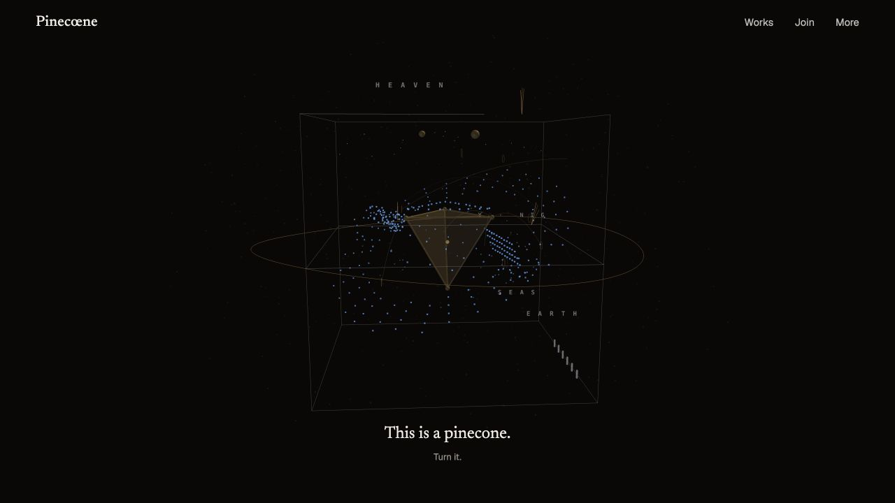
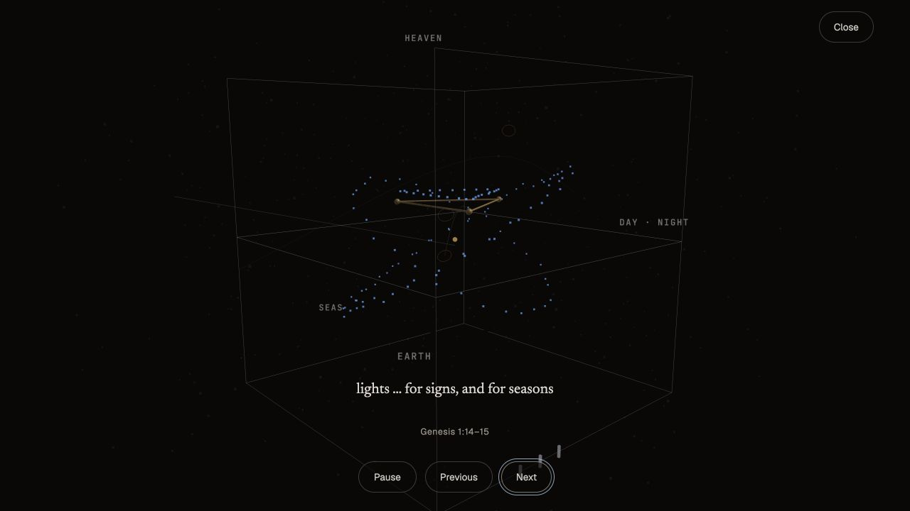
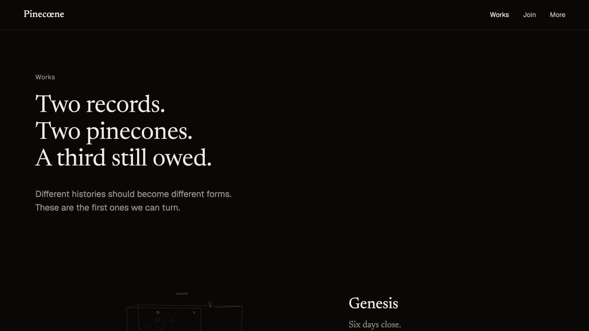
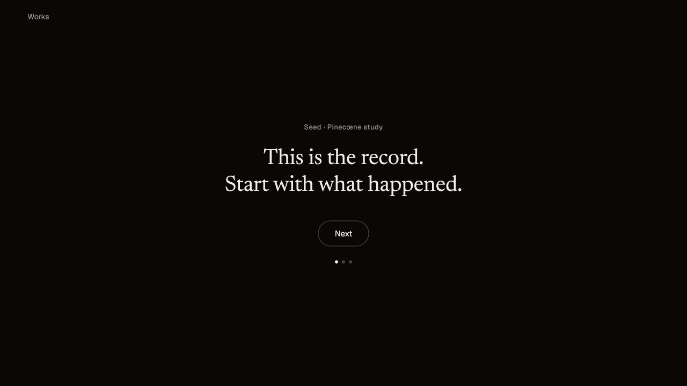
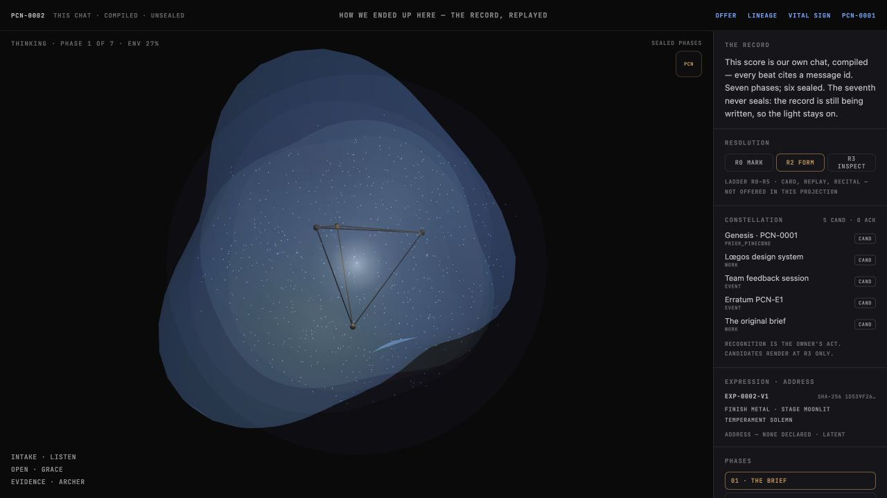
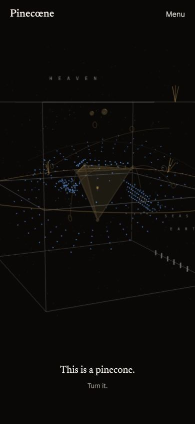

# Pinecœne V3 concept recovery audit

**Standing:** Ideation evidence only. This audit does not accept the prototype as product truth and does not authorize changes to the public site.

**Reviewed:** 27 August 2026

**Concept source:** `concept/PineconeV3/`

**Narrative authority used for comparison:** our current conversation and `library/pinecoene-three-work-door-direction-v0.2.md`.

## Verdict

This concept is useful, but not as a replacement design.

It contains three excellent product discoveries:

1. the same real Fold can remain continuously present while a short human letter changes what it means;
2. Becoming can be made public and comprehensible by removing the Studio console while preserving the causal renderer, captions and controls;
3. a work can be introduced with three plain-language thresholds—record, reading and form—before offering technical depth.

Those discoveries should be recovered. The concept's story model, work catalogue, navigation, Seed rendering and deep instrument should not be adopted unchanged.

Despite being described as a complete redo, the executed prototype is not yet a complete system redesign. The Door and Works shelf are new, but work routes fall back into the older technical instrument, Join and More are mostly stubs, and `Pinecoene.dc.html` remains the previous Offering Loop experience. It is best understood as a valuable public-layer experiment placed in front of the existing machinery.

## Walkthrough

### 1. Door arrival — strong direction, wrong protagonist

The first screen gets the central principle right: a stranger meets a real, turnable Fold before being asked to understand a theory. The dark room, restrained wordmark, short sentence and Newsreader/Geist pairing are warmer and more confident than the current explanatory site.

The problem is narrative authority. The object shown is Genesis. Our current direction says the homepage protagonist is the present V3 Pinecœne—the work becoming through the site's own failed and renewed attempts. Genesis and the Genesis Chat are its lineage, not substitutes for it.

The object is also too diagrammatic and recessive at first sight. Its bounding box, labels and particulate field communicate scientific visualization before they communicate a singular artifact someone might want to hold, turn or share.

**Health:** Promising. Preserve the object-first composition; replace the protagonist and simplify its first-seen visual state.

### 2. The letter — the right structure, with a pacing risk

Keeping one object present while the letter moves through scary, ugly, care, beauty, courage, another world and a shape that can travel is the right narrative architecture. It makes the text a change in the receiver rather than a sequence of marketing sections.

The prototype is roughly nine 720px viewports long, with very large gaps between beats. That can turn a lucid letter into a ceremonial scroll. The live version should feel like seven breaths, not seven chapters. Object motion must remain subordinate to meaning; the page should never feel scroll-jacked.

**Health:** Strong concept, pacing needs reduction and measured testing.

### 3. Becoming — the most valuable invention in V3

This is the clearest recovery candidate. V3 takes the same causal Genesis renderer and removes almost all of the owner-console density. What remains is an immersive stage, a short causal caption, Close, Pause, Previous and Next. It teaches by showing.

The public site should use this interaction pattern for the current V3 work first, with Genesis and the Genesis Chat available as other works. The empty early states need a small amount of orientation so that silence reads as anticipation rather than failure.

**Health:** Excellent interaction model; wrong record is currently cast as the main story.

### 4. Works — elegant shelf, obsolete story

The editorial typography, negative space and alternating object/text rows are excellent. The line “Two records. Two pinecones. A third still owed.” is now false to the story we have established. There are three works:

1. **Genesis** — the first proof that a record could earn a form;
2. **The Genesis Chat** — the conversation in which Pinecœne itself was conceived;
3. **Pinecœne, Becoming** — this site and its repeated attempts becoming the current open work.

“Seed” is a useful poetic name for the second form, but it should not replace the historical identity of the record. A good resolution is: **The Genesis Chat** as the work title, **Seed** as the Fold's form name.

Thin Fold belongs under What’s Next, not as the missing third canonical work.

**Health:** Strong visual pattern; catalogue and copy must be rebuilt around the three-work lineage.

### 5. Work threshold — preserve almost exactly

The three introductory slides are unusually successful:

- this is the record;
- this is the reading;
- now watch the work become.

They translate the machinery into ordinary language without concealing that interpretation and admission exist. This should become the standard first-visit threshold for every work.

“Explore on my own” currently lands at State Zero inside the technical instrument. That is a label/action mismatch. It should open the settled Fold at rest, or the visitor's last chosen view. “Watch Becoming” should begin the causal replay.

**Health:** Excellent; minor copy and destination correction.

### 6. Deep work — the current experience breaks in two

After the warm, plain-language threshold, the concept drops into the older PCN-0002 console: tiny uppercase labels, hashes, phase controls, a dense inspector and owner terminology. The machinery is valuable, but the transition feels like moving from a public artwork into an engineering debugger.

The solution is not to remove the machinery. It is to create one public instrument language:

- Fold at rest as the default;
- Becoming as an immersive mode;
- Record, Reading and Lineage as calm drawers;
- technical provenance and hashes in a collapsed “About this study” drawer;
- Studio-only controls reserved for the maker/owner surface.

This is the largest unresolved design task in the prototype.

**Health:** Functionally rich, experientially discontinuous.

### 7. Mobile — dramatic, but the object loses its integrity

The mobile opening has presence, but the Fold is cropped hard enough that its silhouette and labels become difficult to read. It starts to resemble a zoomed scientific map rather than an object in a room. The mobile composition should preserve a complete, turnable silhouette before allowing zoom.

The concept uses a “Menu” label. Our agreed direction is a pulse where navigation is expected. That pulse should still be a real 44px control with an accessible name, visible focus and a comprehensible opened state.

**Health:** Strong atmosphere; object bounds and navigation need revision.

### 8. Join and More — useful information architecture, not yet product

The grouping is sound: Works and Join are latches; Science, Art, How it’s made and What’s next live under More. They do not walk in front of the Pinecœne.

In the actual prototype, most of these destinations are stubs. The handoff also proposes a real first-sentence submission and the confirmation “It arrived.” That conflicts with our current decision to use an honest placeholder until a real receiving mechanism exists. The public copy must not imply receipt, custody or delivery.

**Health:** Useful map, largely unexecuted and partly inconsistent with current truth.

## What to recover

### Recover directly

- The one-object Door and the principle **same object, changed receiver**.
- The short public Becoming player using the real causal renderer.
- The record → reading → form threshold on first entry to a work.
- Newsreader for the human/artifact voice and Geist for interface language.
- The calm Works shelf and alternating object/editorial rhythm.
- The copy idea: “A messy idea does not become shareable by being explained harder. It becomes shareable by being cared into a form.”
- A collapsed technical provenance drawer rather than permanent instrument chrome.

### Recover, but rename or reposition

- **Seed** as the form name of **The Genesis Chat**, not as a replacement for the record's identity.
- The living/unsealed membrane idea as one state of the Genesis Chat, not a generic glowing-orb identity.
- “The music is still playing” only if sound becomes an actual part of the medium; otherwise use the more exact continuing-record language.
- The More-page architecture behind the navigation pulse.

### Do not carry forward unchanged

- Genesis as the homepage protagonist.
- “Two records. Two pinecones. A third still owed.”
- Thin Fold as the third canonical work.
- The visible Works / Join / More header.
- The generic Siri-like Seed orb as a canonical Fold.
- The sudden transition into the old dense console.
- An active “Bring an idea” form or any “It arrived” claim before receiving infrastructure exists.
- Decorative cosmic or neon imagery without semantic standing.

## Technical and truth findings

- `door-fold.js` demonstrates the correct reuse pattern: extract one renderer so the same Fold can appear in the Door, Works and Becoming instead of creating imitations.
- The Genesis machinery uses deterministic seeded construction in `pcn-core.js`.
- `seed-fold.js` uses `Math.random()` for its particle phases. That violates the deterministic identity law and means identical admitted input can render differently. If Seed survives, it needs seeded topology and semantic references.
- `Pinecoene.dc.html` is still the earlier Offering Loop, while `The Door.dc.html` is the new entrance. The prototype has no single internally consistent root experience.
- Three.js is loaded into the first Door render without a demonstrated static-poster/no-WebGL first-paint path. That is a mobile performance and resilience risk.
- Join and More links are stubs; the prototype should not be described as a complete implemented redo.

## Accessibility observations

The concept has a promising foundation: the Fold stage has a descriptive label and keyboard entry, controls have visible focus, Becoming provides Pause/Previous/Next/Close, and the threshold uses large, simple choices.

Risks that still require verification or correction:

- the full Fold silhouette and essential text must remain legible at 390×844 without clipping;
- invisible turn controls must not become invisible keyboard stops;
- reduced-motion must replace continuous movement with meaningful steps throughout, not only reduce animation speed;
- the old instrument's microtype and low-contrast labels need a public-view alternative;
- a non-WebGL poster/form fallback must preserve the work's meaning and actions.

Screenshots cannot prove screen-reader order, keyboard completion, reduced-motion behavior or performance. Those remain unverified.

## Recommended synthesis

Do not adopt V3 wholesale. Use it as the missing public skin and interaction grammar for the direction already established in conversation:

1. **Door:** current `Pinecœne, Becoming` Fold first; no explanation over it; navigation pulse.
2. **Letter:** the seven short beats, with the same object changing subtly.
3. **Invitation:** Watch one become / See the works / Bring an idea, with Bring an idea explicitly unopened for now.
4. **Works:** Genesis / The Genesis Chat — Seed / Pinecœne, Becoming; Thin Fold under What’s Next.
5. **Work entry:** record / reading / form threshold.
6. **Public work:** Fold at rest, immersive Becoming, calm Record/Reading/Lineage drawers.
7. **Studio:** the fuller owner machinery, clearly separated from the public encounter.
8. **Offering and Locket:** downstream experiences reached only after someone understands the Fold; not the entrance story.

The key design law from the V3 handoff is worth keeping: the homepage is not a presentation about Pinecœne. It is a stranger holding one while a letter changes what the object means.

